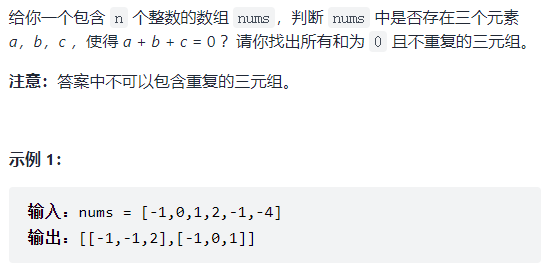

#### 1、ThreeNum

三数之和，双指针移动。答案中三元组不能重复，因此需要进行去重。



```js
/**
 * @param {number[]} nums
 * @return {number[][]}
 */
var threeSum = function(nums) {
    if (nums.length < 3) return [];

    let ans = [];
    nums.sort((a,b) => a-b);  // 升序

    // 升序排序后，从数组左侧开始，若nums[i]大于0，则三数之和不可能为0,
    // 否则，取左指针l=i+1，右指针r=len-1
    // 若nums[i]+nums[l]+nums[r]>0，r--
    // 若nums[i]+nums[l]+nums[r]<0，l++
    // 若nums[i]+nums[l]+nums[r]=0，ans中添加一个答案数组，然后l++, r--
    for (let i = 0; i < nums.length && nums[i] <= 0; i++) {
        // 去重
        if (i >= 1 && nums[i] === nums[i - 1]) {
            continue;
        }

        let l = i + 1, r = nums.length - 1;
        while (l < r) {
            if (nums[i] + nums[l] + nums[r] < 0) {
                l++;
            } else if (nums[i] + nums[l] + nums[r] > 0) {
                r--;
            } else {
                ans.push([nums[l], nums[r], nums[i]]);
                while (nums[l] === nums[l + 1]) l++;	// 去重
                while (nums[r] === nums[r - 1]) r--;	// 去重
                l++;
                r--;
            }
        }
    }

    return ans;
};
```

