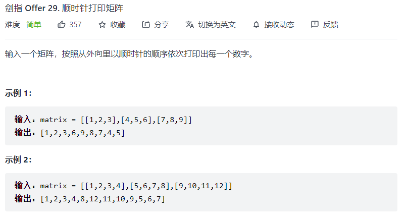
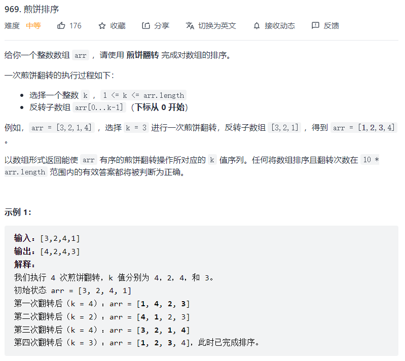

#### 1、ThreeNum

三数之和，双指针移动。答案中三元组不能重复，因此需要进行去重。


```js
/**
 * @param {number[]} nums
 * @return {number[][]}
 */
var threeSum = function(nums) {
    if (nums.length < 3) return [];

    let ans = [];
    nums.sort((a,b) => a-b);  // 升序

    // 升序排序后，从数组左侧开始，若nums[i]大于0，则三数之和不可能为0,
    // 否则，取左指针l=i+1，右指针r=len-1
    // 若nums[i]+nums[l]+nums[r]>0，r--
    // 若nums[i]+nums[l]+nums[r]<0，l++
    // 若nums[i]+nums[l]+nums[r]=0，ans中添加一个答案数组，然后l++, r--
    for (let i = 0; i < nums.length && nums[i] <= 0; i++) {
        // 去重
        if (i >= 1 && nums[i] === nums[i - 1]) {
            continue;
        }

        let l = i + 1, r = nums.length - 1;
        while (l < r) {
            if (nums[i] + nums[l] + nums[r] < 0) {
                l++;
            } else if (nums[i] + nums[l] + nums[r] > 0) {
                r--;
            } else {
                ans.push([nums[l], nums[r], nums[i]]);
                while (nums[l] === nums[l + 1]) l++;	// 去重
                while (nums[r] === nums[r - 1]) r--;	// 去重
                l++;
                r--;
            }
        }
    }

    return ans;
};
```


#### 2、区间合并


**排序**：按区间下界升序的原则进行排序，若区间下界相等，则按区间上界降序的原则排序。排序后，遍历intervals的每个元素，若当前元素的下界大于之前合并的区间的上界，则将之前合并好的区间加入ans中。

```js
/**
 * @param {number[][]} intervals
 * @return {number[][]}
 */
var merge = function(intervals) {
    if (intervals.length === 1) return intervals;

    let ans = [];
    // 排序
    intervals.sort((a, b) => a[0] === b[0] ? b[1] - a[1] : a[0] - b[0]);

    let tmp = [intervals[0][0], intervals[0][1]];
    for (let i = 1; i < intervals.length; i++) {
        // 若之间合并好的区间与当前元素区间无交集，则将之前合并好的区间加入ans
        if (tmp[1] < intervals[i][0]) {
            ans.push(tmp);
            // tmp设为当前区间
            tmp = [intervals[i][0], intervals[i][1]];
            continue;
        }

        tmp = [tmp[0], Math.max(tmp[1], intervals[i][1])];
    }
    ans.push(tmp);

    return ans;
};
```


#### 3、双栈实现队列

```js
var CQueue = function() {
    this.stack1 = [];  // 入队栈
    this.stack2 = [];  // 出队栈
};

CQueue.prototype.appendTail = function(value) {
    this.stack1.push(value);
};

CQueue.prototype.deleteHead = function() {
    if (!this.stack2.length) {
        while (this.stack1.length) {
            this.stack2.push(this.stack1.pop());
        }
    }
    return this.stack2.pop() ?? -1;
};

/**
 * Your CQueue object will be instantiated and called as such:
 * var obj = new CQueue()
 * obj.appendTail(value)
 * var param_2 = obj.deleteHead()
 */
```


#### 4、顺时针打印矩阵



```js
/**
 * @param {number[][]} matrix
 * @return {number[]}
 */
var spiralOrder = function(matrix) {
    if (matrix.length === 0) {
        return [];
    }

    const m = matrix.length, n = matrix[0].length;
    // 分别表示左右上下四个边界
    let l = 0, r = n - 1, u = 0, d = m - 1;
    let ans = [];

    while (1) {
        // 左到右
        for (let i = l; i <= r; i++) ans.push(matrix[u][i]);
        if (++u > d) break;
        // 上到下
        for (let i = u; i <= d; i++) ans.push(matrix[i][r]);
        if (--r < l) break;
        // 右到左
        for (let i = r; i >= l; i--) ans.push(matrix[d][i]);
        if (--d < u) break;
        // 下到上
        for (let i = d; i >= u; i--) ans.push(matrix[i][l]);
        if (++l > r) break;
    }

    return ans;
};
```


#### 5、煎饼排序



**思路：**

类似冒泡排序，每次需要在现有数组 arr 中找出最大值，若其索引不在最后一位，则先将其交换到首位，再将其交换到末位（此交换过程中需要对子数组的所有元素进行倒转），然后从末位弹出此最大值，直到数组中无元素。

```js
/**
 * @param {number[]} arr
 * @return {number[]}
 */
var pancakeSort = function(arr) {
  let ans = [];
    
  while (arr.length) {
    let max = Number.MIN_SAFE_INTEGER;
    let ind = -1;
    // 找出当前最大值的索引
    for (let i = 0; i < arr.length; i++) {
      if (arr[i] > max) {
        ind = i;
        max = arr[i];
      }
    }
    // 最大值已经在最右侧，直接弹出
    if (ind === arr.length - 1) {
      arr.pop();
      continue;
    }
    // 先把该最大值交换到首位，再将其交换到末位，然后弹出
    ans.push(ind + 1);
    ans.push(arr.length);
    reverseArr(arr, 0, ind);
    reverseArr(arr, 0, arr.length - 1);
    arr.pop();
  }
  return ans;
};

function reverseArr(arr, fromInd, toInd) {
  for (let i = fromInd; i <= (toInd - fromInd >> 1); i++) {
    if (i !== toInd - i) {
      // 奇数个元素时，最中间元素不必交换
      arr[i] ^= arr[toInd - i];
      arr[toInd - i] ^= arr[i];
      arr[i] ^= arr[toInd - i];
    }
  }
}
```

