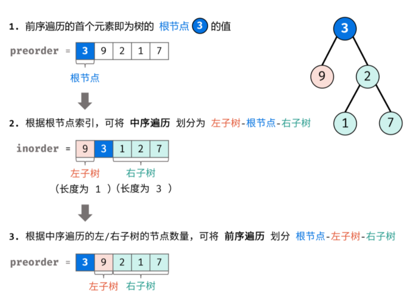
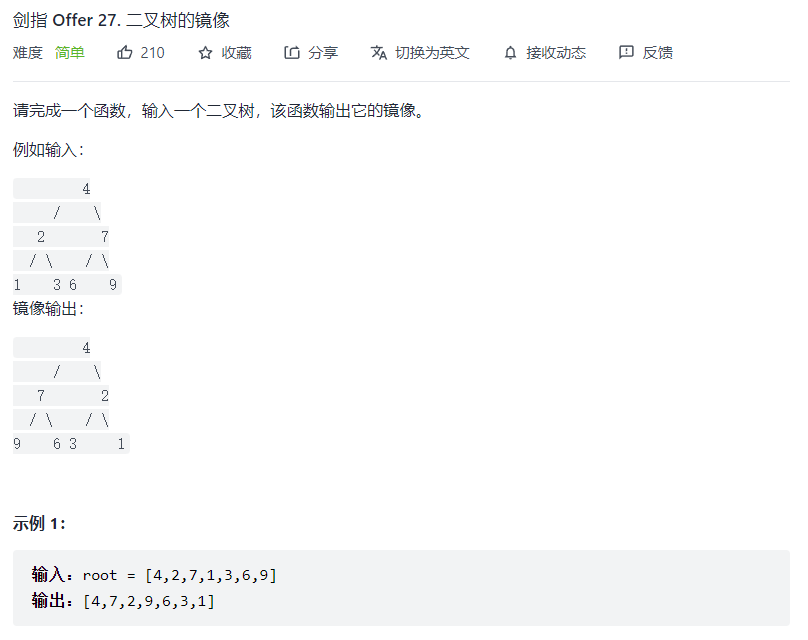

二叉树大多使用递归方式从左右子树向下递归。

#### 1、计算二叉树最大深度

```js
var maxDepth = function (root) {
    if (root === null) return 0;
    return 1 + Math.max(maxDepth(root.left), maxDepth(root.right));
};
```

#### 2、二叉树层序遍历为二维数组

```
    3               
   / \
  5   2
 / \ / \
8  3 4  1
输出结果应为 [[3], [5, 2], [8, 3, 4, 1]]
实际上就是一个二叉树层序遍历的问题，需要判断什么时候换层(i === ans.length时)
```

```js
// 递归
var levelOrder = function (root) {
    let ans = [];
    helper(root, ans, 0);
    return ans;
};

function helper(node, ans, i) {
    if (node === null) return;
    if (i === ans.length) ans.push([]);
    ans[i].push(node.val);
    
    helper(node.left, ans, i+1);
    helper(node.right, ans, i+1);
}

// 迭代
var levelOrder = function(root) {
    if (root === null) return [];

    let queue = [];
    let ans = [];
    queue.push(root);
    
    while (queue.length) {
        let tmp = [];
        let len = queue.length;

        while (len--) {
            let cur = queue.shift();
            tmp.push(cur.val);
            if (cur.left) queue.push(cur.left);
            if (cur.right) queue.push(cur.right);
        }

        ans.push(tmp)
    }

    return ans;
};
```

#### 3、由前序和中序构建二叉树



```js
/**
 * Definition for a binary tree node.
 * function TreeNode(val) {
 *     this.val = val;
 *     this.left = this.right = null;
 * }
 */
/**
 * @param {number[]} preorder
 * @param {number[]} inorder
 * @return {TreeNode}
 */
var buildTree = function(preorder, inorder) {
  // 先序遍历：根左右，第一个节点为根节点
  // 中序遍历：左右根，可根据先序遍历找到根节点左右子树
  let rootMap = new Map();
  for (let i = 0; i < inorder.length; i++) {
    // 存放根节点的值在inorder中对应的位置，避免反复扫描
    rootMap.set(inorder[i], i);
  }

  var func = function (root, l, r) {
    // root: 从先序中取根节点值的索引
    // l: inorder 的左边界
    // r: inorder 的右边界
    if (l > r)  return null;

    // rootInInd: 当前根在中序数组的位置
    // leftPreInd/rightPreInd：左右子树根节点在前序数组中的位置
      
    // preorder[root]是当前根节点的值，并由此获取当前根节点在中序数组中的位置
    var rootInInd = rootMap.get(preorder[root]);
    
    // 获取到了根节点在中序数组中的位置，就能找到其左右两侧的左右子树的节点数目
    // 进而在先序数组中找到左右子树根节点的索引
    var leftCnt = rootInInd - l, leftPreInd = root + 1;
    var rightCnt = r - rootInInd, rightPreInd = root + leftCnt + 1;

    var rootNode = new TreeNode(preorder[root]);

    // 递归地
    rootNode.left = func(leftPreInd, l, rootInInd - 1);
    rootNode.right = func(rightPreInd, rootInInd + 1, r);

    return rootNode;
  }

  // 初始时，根节点即为先序第一个，此时需要扫描整个中序数组，因此 l = 0, r = len - 1
  return func.call(func, 0, 0, inorder.length - 1);
};

```

#### 4、镜像翻转二叉树



```js
/**
 * Definition for a binary tree node.
 * function TreeNode(val) {
 *     this.val = val;
 *     this.left = this.right = null;
 * }
 */
/**
 * @param {TreeNode} root
 * @return {TreeNode}
 */
var mirrorTree = function(root) {
    if (root === null) {
        return null;
    }
    // 对左右子树递归
    const left = mirrorTree(root.left);
    const right = mirrorTree(root.right);
    // 将分治并镜像翻转后的两棵子树交换
    root.left = right;
    root.right = left;
    
    return root;
}
```

