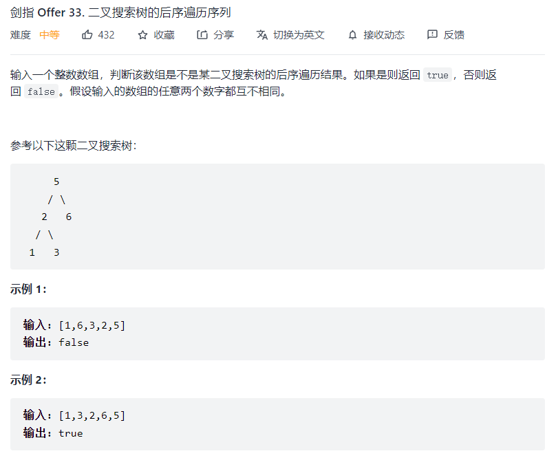
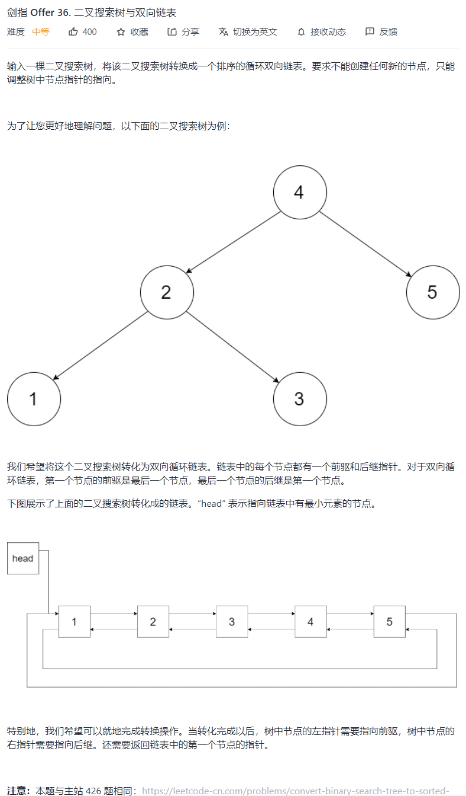
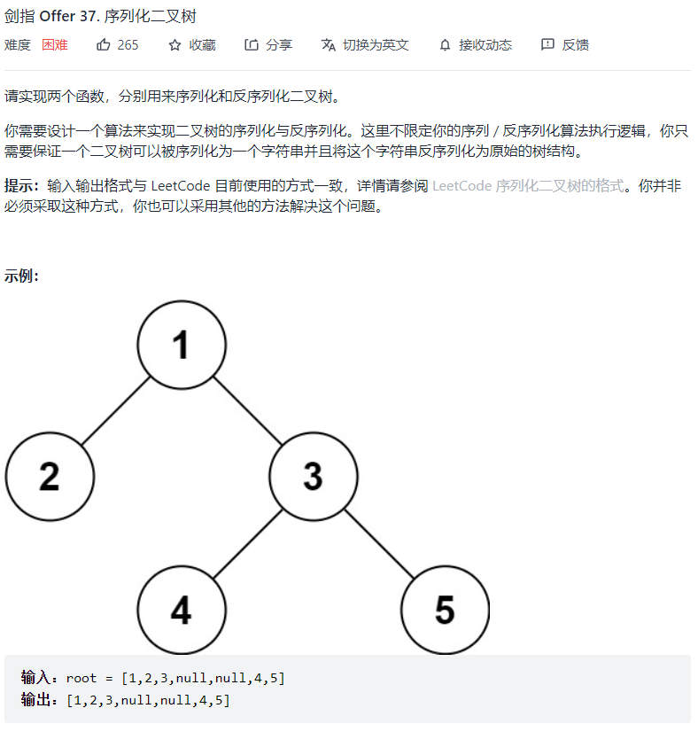

二叉树大多使用递归方式从左右子树向下递归。

#### 1、计算二叉树最大深度

```js
var maxDepth = function (root) {
    if (root === null) return 0;
    return 1 + Math.max(maxDepth(root.left), maxDepth(root.right));
};
```

#### 2、二叉树层序遍历为二维数组

```
    3               
   / \
  5   2
 / \ / \
8  3 4  1
输出结果应为 [[3], [5, 2], [8, 3, 4, 1]]
实际上就是一个二叉树层序遍历的问题，需要判断什么时候换层(i === ans.length时)
```

```js
// 递归
var levelOrder = function (root) {
    let ans = [];
    helper(root, ans, 0);
    return ans;
};

function helper(node, ans, i) {
    if (node === null) return;
    if (i === ans.length) ans.push([]);
    ans[i].push(node.val);
    
    helper(node.left, ans, i+1);
    helper(node.right, ans, i+1);
}

// 迭代
var levelOrder = function(root) {
    if (root === null) return [];

    let queue = [];
    let ans = [];
    queue.push(root);
    
    while (queue.length) {
        let tmp = [];
        let len = queue.length;

        while (len--) {
            let cur = queue.shift();
            tmp.push(cur.val);
            if (cur.left) queue.push(cur.left);
            if (cur.right) queue.push(cur.right);
        }

        ans.push(tmp)
    }

    return ans;
};
```

#### 3、由前序和中序构建二叉树


```js
/**
 * Definition for a binary tree node.
 * function TreeNode(val) {
 *     this.val = val;
 *     this.left = this.right = null;
 * }
 */
/**
 * @param {number[]} preorder
 * @param {number[]} inorder
 * @return {TreeNode}
 */
var buildTree = function(preorder, inorder) {
  // 先序遍历：根左右，第一个节点为根节点
  // 中序遍历：左右根，可根据先序遍历找到根节点左右子树
  let rootMap = new Map();
  for (let i = 0; i < inorder.length; i++) {
    // 存放根节点的值在inorder中对应的位置，避免反复扫描
    rootMap.set(inorder[i], i);
  }

  var func = function (root, l, r) {
    // root: 从先序中取根节点值的索引
    // l: inorder 的左边界
    // r: inorder 的右边界
    if (l > r)  return null;

    // rootInInd: 当前根在中序数组的位置
    // leftPreInd/rightPreInd：左右子树根节点在前序数组中的位置
      
    // preorder[root]是当前根节点的值，并由此获取当前根节点在中序数组中的位置
    var rootInInd = rootMap.get(preorder[root]);
    
    // 获取到了根节点在中序数组中的位置，就能找到其左右两侧的左右子树的节点数目
    // 进而在先序数组中找到左右子树根节点的索引
    var leftCnt = rootInInd - l, leftPreInd = root + 1;
    var rightCnt = r - rootInInd, rightPreInd = root + leftCnt + 1;

    var rootNode = new TreeNode(preorder[root]);

    // 递归地
    rootNode.left = func(leftPreInd, l, rootInInd - 1);
    rootNode.right = func(rightPreInd, rootInInd + 1, r);

    return rootNode;
  }

  // 初始时，根节点即为先序第一个，此时需要扫描整个中序数组，因此 l = 0, r = len - 1
  return func.call(func, 0, 0, inorder.length - 1);
};

```

#### 4、镜像翻转二叉树


```js
/**
 * Definition for a binary tree node.
 * function TreeNode(val) {
 *     this.val = val;
 *     this.left = this.right = null;
 * }
 */
/**
 * @param {TreeNode} root
 * @return {TreeNode}
 */
var mirrorTree = function(root) {
    if (root === null) {
        return null;
    }
    // 对左右子树递归
    const left = mirrorTree(root.left);
    const right = mirrorTree(root.right);
    // 将分治并镜像翻转后的两棵子树交换
    root.left = right;
    root.right = left;
    
    return root;
}
```

#### 5、树的子结构


```js
/*
 * @param {TreeNode} A
 * @param {TreeNode} B
 * @return {boolean}
 */
var isSubStructure = function(A, B) {
    if (A === null || B === null) {
        return false;
    }

    const recur = (A, B) => {
        // 判断B是否是A的子结构，依次左右节点递归地对比
        if (B === null) {
            return true;
        }
        if (A === null) {
            return false;
        }
        if (A.val === B.val) {
            return recur(A.left, B.left) && recur(A.right, B.right);
        } else {
            return false;
        }
    }
    // 对A和B先整体判断是否是子结构，再递归地判断A的左子树和A的右子树
    return recur(A, B) || isSubStructure(A.left, B) || isSubStructure(A.right, B);
};
```


#### 6、判断一个后序遍历数组是否是某BST



```js
/**
 * @param {number[]} postorder
 * @return {boolean}
 */
var verifyPostorder = function(postorder) {
    // BST: 左子树所有节点值 < 父节点 < 右子树所有节点值
    // 后序：左右中，每次的最后一个元素就是根
    return recur(postorder, 0, postorder.length - 1);
};

function recur (postorder, i, j) {
    // i, j 为当前子树在后序数组中的子数组索引值
    if (i >= j) return true;
    // p: 指针，初始指向左边
    let p = i;
    // 找到后序子数组中第一个大于根节点（最后一个元素）的节点，此即左右子树的分界点
    while (postorder[p] < postorder[j]) p++;
    // 将分界点索引赋值为m
    let m = p;
    // 继续向右遍历右子树
    while (postorder[p] > postorder[j]) p++;
    // 若确实是某BST的后序遍历，则p指针到最后会指向根节点，然后对左右子树递归地判断
    return p === j && recur(postorder, i, m - 1) && recur(postorder, m, j - 1);
}
```


#### 7、将BST转化为双向链表



**思路：**

- 利用BST的性质，中序遍历后一定是升序数组，并符合双向链表的顺序要求

- head节点指向BST中最小的节点，pre节点为当前节点的前序节点
- 递归地进行中序遍历，直到找到最小值，此时pre还未赋值，将head指向最小节点
- 对于每个非最小的节点，进行 `cur.left = pre;  pre.right = cur;  pre = cur;` 的转化关系
- 最后，将 head.left 指向最后节点（此时为pre），将 pre.right 指向 head

```js
/**
 * // Definition for a Node.
 * function Node(val,left,right) {
 *    this.val = val;
 *    this.left = left;
 *    this.right = right;
 * };
 */
var treeToDoublyList = function(root) {
    if (!root) return root;
    let head, pre;
    // cur.left = pre;  pre.right = cur;

    function dfs(cur) {
        // 中序遍历
        if (!cur) return;

        dfs(cur.left);

        // 如果此时pre未被赋值，说明是BST中的最小节点，将head指向它
        if (!pre) head = cur;
        // 如果有pre节点，说明遍历到了非最小节点，将pre的后继设为cur
        else pre.right = cur;
		
        // 将cur的前驱设为pre
        cur.left = pre;
        // 更新pre至cur
        pre = cur;

        dfs(cur.right);
    }

    dfs(root);
    head.left = pre;
    pre.right = head;
    return head;
};
```


#### 8、序列化二叉树



**思路：**

- BFS，层序遍历，利用队列进行辅助
- 对于序列化函数，从根节点开始BFS，需要记录该二叉树的完整信息，因此每个null也要作为一个值放入res中
- 对于反序列化函数，从根节点开始BFS，对每次出列的节点cur，为其添加左右节点（这时需要判断JSON.parse后得到的层序遍历节点数组的`arr[i]`元素是否为null，如果是null则跳过，否则为cur的左右节点进行创建赋值）

```js
/**
 * Definition for a binary tree node.
 * function TreeNode(val) {
 *     this.val = val;
 *     this.left = this.right = null;
 * }
 */

/**
 * Encodes a tree to a single string.
 *
 * @param {TreeNode} root
 * @return {string}
 */
var serialize = function(root) {
    // 常规层序遍历
    if (root == null) return "[]"
    let queue = [root], res = []
    while(queue.length) {
        let node = queue.shift()
        if (node != null) {
            queue.push(node.left)
            queue.push(node.right)
            res.push(node.val)
        } else {
            res.push(null)
        }
    }
    return JSON.stringify(res)
};

/**
 * Decodes your encoded data to tree.
 *
 * @param {string} data
 * @return {TreeNode}
 */
var deserialize = function(data) {
    if (data == '[]') return null
    let arr = JSON.parse(data)
    let root = new TreeNode(arr[0])
    let queue = [root], i = 1
    while(queue.length && i < arr.length) {
        // BFS，arr为用于赋值的层序遍历数组，queue为辅助队列
        // 队列的操作可以用一个索引值 index 维护，用于替代 shift，可以提升效率
        let node = queue.shift()
        if (arr[i] != null){
            node.left = new TreeNode(arr[i])
            queue.push(node.left)
        }
        i++
        if (arr[i] != null){
            node.right = new TreeNode(arr[i])
            queue.push(node.right)
        }
        i++
    }
    return root

};
```

