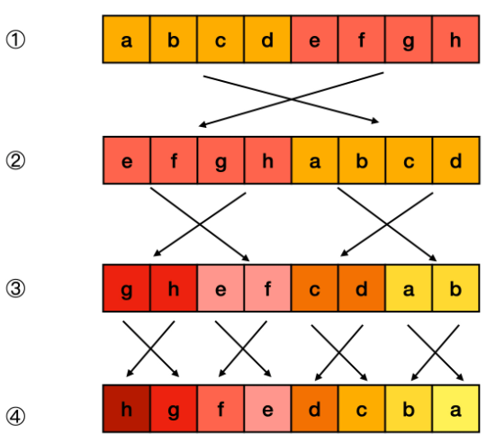

一般用按位运算符和二进制转换 `Number.parseInt()` 和 `Number.prototype.toString()` 解决。

#### 1、将一个32位数字的二进制进行倒序

**利用库函数：**

```js
var reverseBits = function(n) {
    let t = n.toString(2).split("");	// 转为数组
    while (t.length < 32) t.unshift("0");  // 数组头部添0凑够32位
    return parseInt(t.reverse().join(""), 2);
}
```

**位运算分治：**



- 若要翻转一个二进制串，可以将其均分成左右两部分，对每部分递归执行翻转操作，然后将左半部分拼在右半部分的后面，即完成了翻转。


- 由于左右两部分的计算方式是相似的，利用位掩码和位移运算，我们可以自底向上地完成这一分治流程。


- 对于递归的最底层，我们需要交换所有奇偶位：
  - 取出所有奇数位和偶数位；
  - 将奇数位移到偶数位上，偶数位移到奇数位上。
  - 类似地，对于倒数第二层，每两位分一组，按组号取出所有奇数组和偶数组，然后将奇数组移到偶数组上，偶数组移到奇数组上。以此类推。

- 需要注意的是，在某些语言（如 Java）中，没有无符号整数类型，因此对 n 的右移操作应使用逻辑右移。


```js
var reverseBits = function(n) {
    const M1 = 0x55555555; // 01010101010101010101010101010101
    const M2 = 0x33333333; // 00110011001100110011001100110011
    const M4 = 0x0f0f0f0f; // 00001111000011110000111100001111
    const M8 = 0x00ff00ff; // 00000000111111110000000011111111

    // >>> 为以0填充的右位移
    n = n >>> 1 & M1 | (n & M1) << 1;
    n = n >>> 2 & M2 | (n & M2) << 2;
    n = n >>> 4 & M4 | (n & M4) << 4;
    n = n >>> 8 & M8 | (n & M8) << 8;
    return (n >>> 16 | n << 16) >>> 0;
};
```

