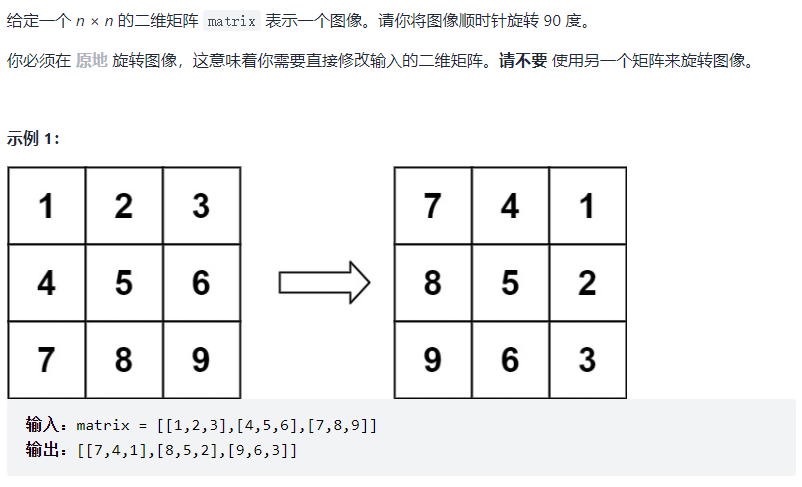

注意事项：如果使用累加、累乘等常数级别增长，可能出现超时，因此需要指数级别增长来找到结果。

#### 1、计算 $x^n$

- 累乘：$x\times x\times \dots\times x$
- 转换为指数级增长：$2^9=2\times4^4=2\times16^2=2\times256=512$，对于 $x^n$：
  - 若 n % 2 !== 0，即 n 为奇数，则 $x^n = x \times(x^{2^{{\lfloor\frac{n}{2}\rfloor}}})$
  - 否则，$x^n=x^{2^{\frac{n}{2}}}$
  - 此即 **快速幂** 算法

```js
var xPow = function (x, n) {
    if (n === 0) return 1;
    if (n < 0) {
        n = -n;
        x = 1 / x;
    }
    return (n % 2 === 0) ?
        xPow(x * x, n / 2) :
    	x * xPow(x * x, parseInt(n / 2));
}
```

#### 2、求 $\sqrt{x}$

使用二分法。

```js
var xSqrt = function (x) {
    let l = 0, r = x;
    while (true) {
        let mid = l + parseInt(l + (r - l) / 2);
        if (mid * mid > x) {
            r = mid - 1;
        } else if (mid * mid < x) {
            if ( (mid + 1) * (mid + 1) > x )  return mid;
            l = mid + 1;
        } else return mid;
    }
}
```

#### 3、顺时针旋转矩阵



**原地旋转**就需要找到行和列的对应关系。此题可以将矩阵先水平对称反转后再沿右对角线进行对称变换即可。需要找到两次变换的行列对应关系。

```js
var rotate = function(matrix) {
    // 先沿垂直分割线水平翻转
    const len = matrix.length;
    for (let j = 0; j < Math.floor(len / 2); j++) {
        for (let i = 0; i < len; i++) {
            let tmp = matrix[i][len - j - 1];
            matrix[i][len - j - 1] = matrix[i][j];
            matrix[i][j] = tmp;
        }
    }
    // 再沿右对角线翻转
    // m[1][0]  m[len - 1][2]
    // len - col - 1 => row'
    // len - row - 1 => col'
    for (let j = len - 2; j >= 0; j--) {
        for (let i = 0; i < len - j; i++) {
            let tmp = matrix[i][j];
            matrix[i][j] = matrix[len - j - 1][len - i - 1];
            matrix[len - j - 1][len - i - 1] = tmp;
        }
    }
};
```

