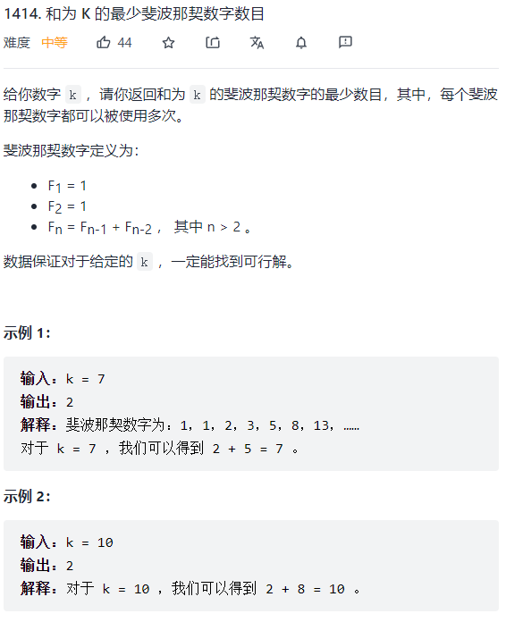
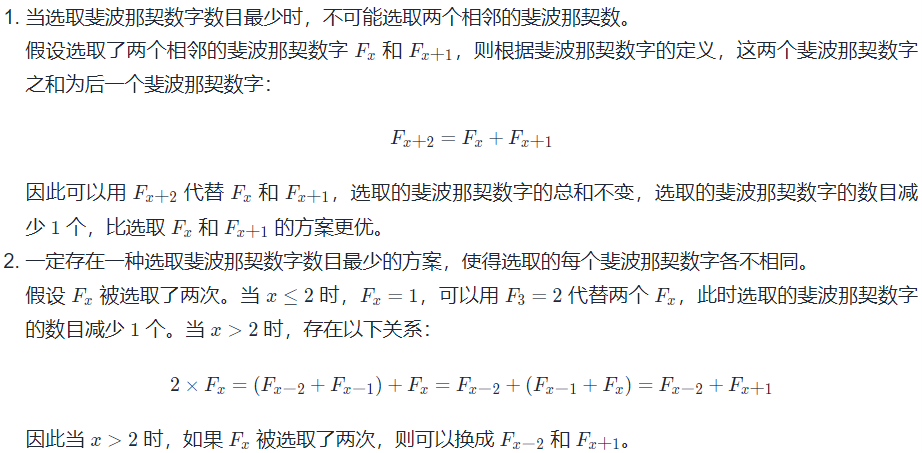
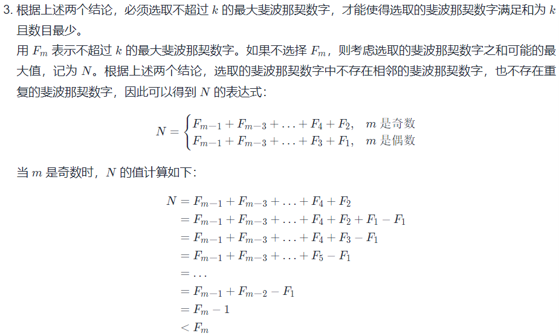
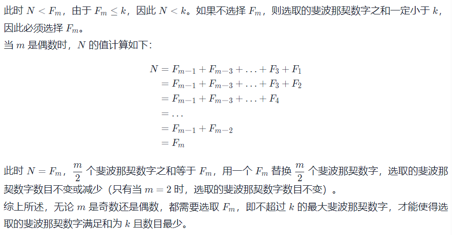

贪心算法的本质是寻找最优解，对于求和类问题，若要找到数量最少数字的和满足答案，则需要将候选数字升序排列，最右侧数字不大于目标值。然后从最右侧开始向左遍历，用目标值不断减去数组当前值（前提是当前数组值小于等于当前目标值），直到减为0即可。

#### 和为K的最少斐波那契数字数目



**思路：**

首先找到所有不超过 k 的斐波那契数字，然后每次贪心地选取不超过 k 的最大斐波那契数字，将 k 减去该数字，重复操作直到 k 变为 0，此时选取的斐波那契数字满足和为 k 且数目最少。

**证明：**







```js
var findMinFibonacciNumbers = function(k) {
    let fib = [1, 1], ans = 0;
    let a = 1, b = 1;
    while (a + b <= k) {
        const c = a + b;
        fib.push(c);
        a = b;
        b = c;
    }

    for (let i = fib.length - 1; i >= 0; i--) {
        const num = fib[i];
        if (num <= k) {
            k -= num;
            ans++;
        }
    }

    return ans;
};
```

