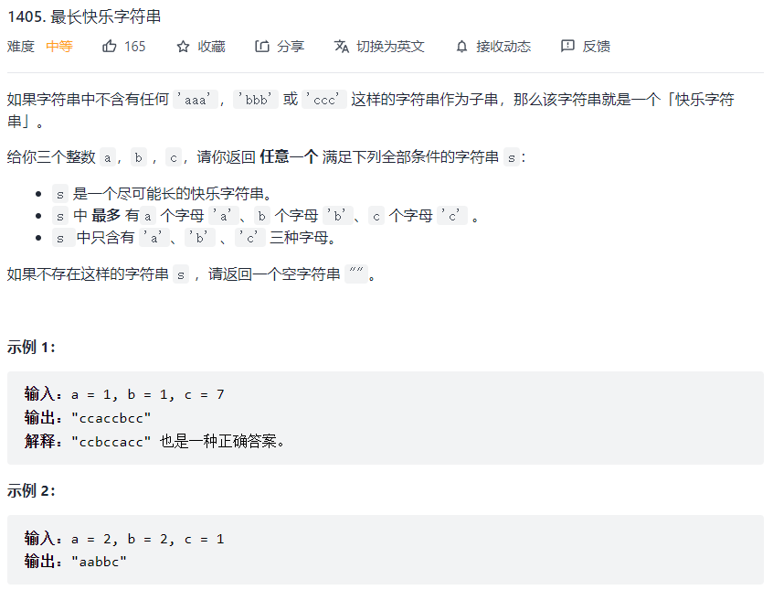

贪心算法的本质是寻找最优解，对于求和类问题，若要找到数量最少数字的和满足答案，则需要将候选数字升序排列，最右侧数字不大于目标值。然后从最右侧开始向左遍历，用目标值不断减去数组当前值（前提是当前数组值小于等于当前目标值），直到减为0即可。

#### 1、和为K的最少斐波那契数字数目


**思路：**

首先找到所有不超过 k 的斐波那契数字，然后每次贪心地选取不超过 k 的最大斐波那契数字，将 k 减去该数字，重复操作直到 k 变为 0，此时选取的斐波那契数字满足和为 k 且数目最少。

**证明：**


```js
var findMinFibonacciNumbers = function(k) {
    let fib = [1, 1], ans = 0;
    let a = 1, b = 1;
    while (a + b <= k) {
        const c = a + b;
        fib.push(c);
        a = b;
        b = c;
    }

    for (let i = fib.length - 1; i >= 0; i--) {
        const num = fib[i];
        if (num <= k) {
            k -= num;
            ans++;
        }
    }

    return ans;
};
```


#### 2、最长的快乐字符串



**思路：**

- 尽可能优先使用当前字符数最多的字符，因为最后同一字符剩余数目越多，越容易出现多个连续的情况，如果构建完最长快乐字符串后还有剩余未选择的字符，则剩余字母一定是同一种字母且该字母总数最多
- 依次从当前数量最多的字母开始尝试，如果发现加入当前字母会导致出现三个连续字母，则跳过当前字母，直到找到可以添加的字母为止，实际上每次只会在数量最多和次多的字母中选择一个
- 如果尝试所有字母都无法添加，则直接退出，返回结果即可

**时间复杂度**：$O((a+b+c)\times ClogC)$，其中 a, b, c 为给定的整数，C 表示字母的种类，即为 3。每次从待选字母中选择一个字母需要执行一次排序，时间复杂度为 $O(ClogC)$，最多需要选择 $a+b+c$ 个字母

**空间复杂度**：$O(C)$

```js
var longestDiverseString = function(a, b, c) {
    const res = [];
    const arr = [[a, 'a'], [b, 'b'], [c, 'c']];
    
    while (true) {
        // 重新排序
        arr.sort((a, b) => b[0] - a[0]);
        // 用于记录是否可以再添加字符
        let hasNext = false;
        for (const [i, [c, ch]] of arr.entries()) {
            if (c <= 0) {
                // 次数已用完
                break;
            }
            const m = res.length;
            if (m >= 2 && res[m - 2] === ch && res[m - 1] === ch) {
                // 若添加后导致出现三个连续字母
                continue;
            }
            hasNext = true;
            // 添加字符，并计数减一
            res.push(ch);
            arr[i][0]--;
            // 退出for循环，重新对arr排序
            break;
        }
        if (!hasNext) {
            // 若无法再添加字符
            break;
        }
    }
    
    return res.join('');
};
```

