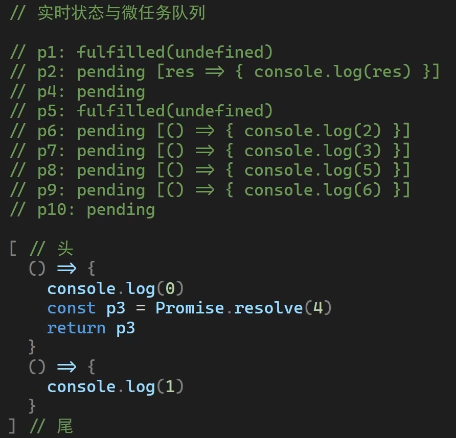
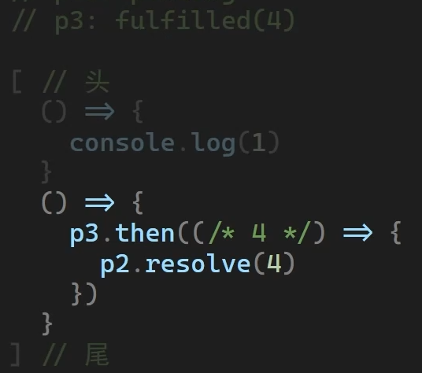
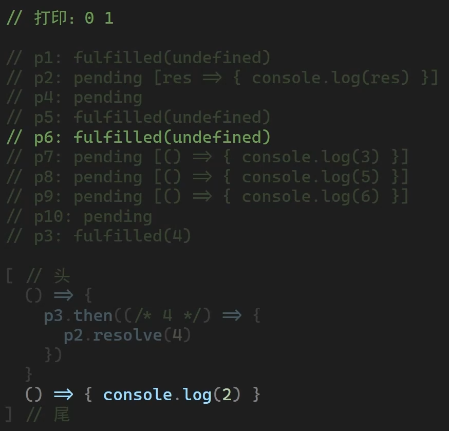
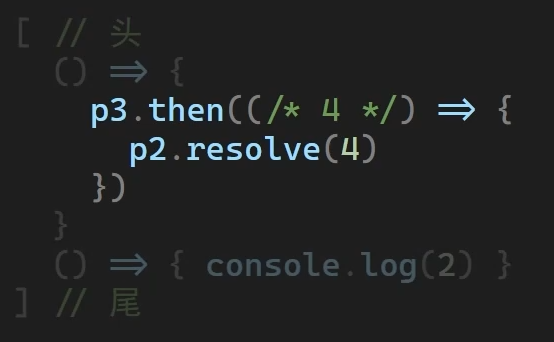
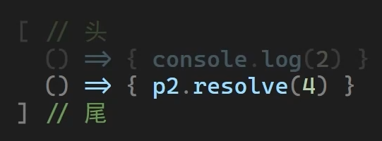
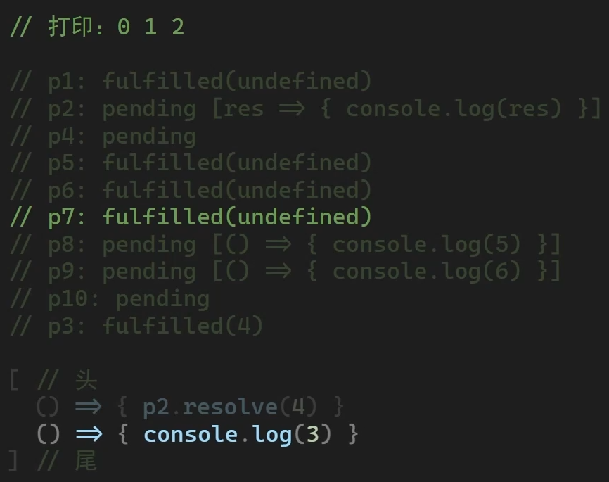
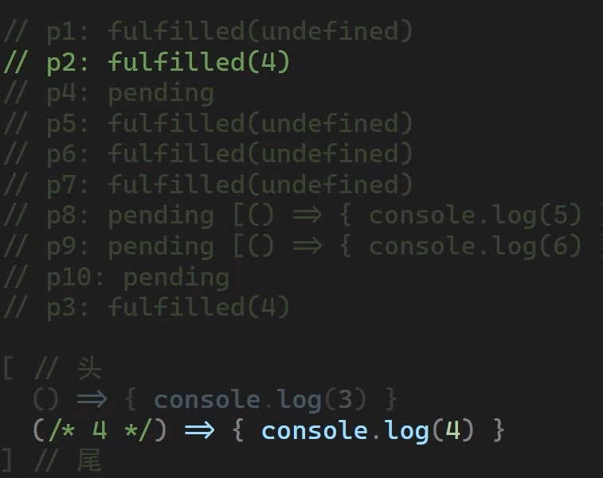
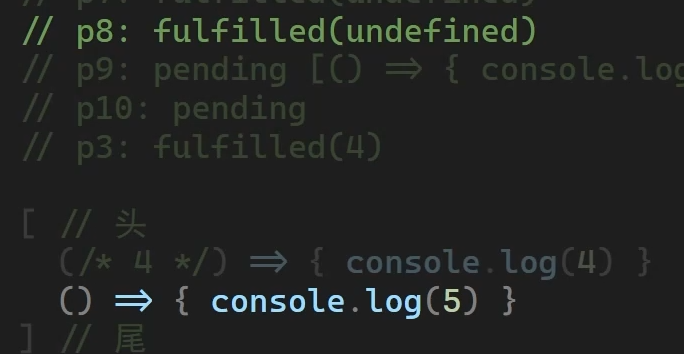

### Promise.then() 中的返回值不同情况剖析

#### 1、Promise.resolve

该方法返回一个以给定值解析后的 Promise 对象，如果参数也是一个 promise，那么将返回这个 promise；如果这个值是 thenable 的，返回的 promise 会“跟随”这个thenable的对象，并采用它的最终状态。也就是说，这个函数可以将类 promise 对象的多层嵌套展平（因此不要在then方法中试图resolve自己）

#### 2、Promise.prototype.then

该方法返回一个 Promise 对象，参数 onFulfilled 和 onRejected 都是函数类型，如果不是，则会被替换为 x => x 的形式。

**then 中的回调函数返回值的情况**：

- 返回一个值，那么 then 返回的 Promise 将会成为 fulfilled 状态，并将返回的值作为 fulfilled 状态的 Promise 回调函数的参数
- 没有返回任何值，那么 then 返回的 Promise 将会成为 fulfilled 状态，并将 undefined 作为 fulfilled 状态的 Promise 回调函数的参数
- 抛出一个错误，那么 then 返回的 Promise 将会成为 rejected 状态，并将抛出的错误作为 rejected 状态的 Promise 回调函数的参数
- 返回一个已经是 fulfilled 状态的 Promise1，那么 then 返回的 Promise2 也会成为接受状态，并将 Promise1 的回调函数的参数值作为 Promise2 回调函数的参数值
- 返回一个已经是 rejected 状态的 Promise1，那么 then 返回的 Promise2 也会成为拒绝状态，并将 Promise1 的回调函数的参数值作为 Promise2 回调函数的参数值
- 返回一个 pending 状态的 Promise1，那么 then 返回的 Promise2 也是 pending 的，且 Promise2 的终态与 Promise1 的终态相同，并将 Promise1 终态的回调函数的参数值作为 Promise2 终态的回调函数的参数值


### 宏任务与微任务

```js
/**
 * JS事件循环顺序：
 * 注：“任务”就是函数
 * 1、同步任务
 * 2、异步微任务
 * 3、DOM渲染页面
 * 4、异步宏任务
 *
 * 宏任务
 * 1、script，即整体的同步代码
 * 2、setTimeout、setInterval的回调
 * 3、UI渲染
 * 4、postMessage
 * 5、setImmediate、IO(Nodejs)
 * 微任务
 * 1、Promise.then、catch、finally
 * 2、async函数，但async函数本身依然是同步执行的，除非有await出现
 * 3、await其实是异步的，跟then差不多，因此await表达式之后的函数体视为微任务
 * 4、当async函数体中await后仍有表达式时，它的then没有触发，只有在下一轮循环中执行了
 *    await后面的函数部分后才能继续将async的then中的函数放入微任务队列
 * 5、process.nextTick
 */
```


#### 实例1


| 源代码                                                       | 拆解版本                                                     |
| ------------------------------------------------------------ | ------------------------------------------------------------ |
| Promise.resolve().then(() => {<br/>  console.log(0);<br/>  return Promise.resolve(4);<br/>}).then(res => {<br/>  console.log(res);<br/>});<br/><br/>Promise.resolve().then(() => {<br/>  console.log(1);<br/>}).then(() => {<br/>  console.log(2);<br/>}).then(() => {<br/>  console.log(3);<br/>}).then(() => {<br/>  console.log(5);<br/>}).then(() => {<br/>  console.log(6);<br/>}) | const p1 = Promise.resolve()<br/>const p2 = p1.then(() => {<br/>  console.log(0)<br/>  const p3 = Promise.resolve(4);<br/>  return p3;<br/>})<br/>const p4 = p2.then(res => {<br/>  console.log(res)<br/>})<br/><br/>const p5 = Promise.resolve();<br/>const p6 = p5.then(() => {<br/>  console.log(1)<br/>})<br/>const p7 = p6.then(() => {<br/>  console.log(2)<br/>})<br/>const p8 = p7.then(() => {<br/>  console.log(3)<br/>})<br/>const p9 = p8.then(() => {<br/>  console.log(5)<br/>})<br/>const p10 = p9.then(() => {<br/>  console.log(6)<br/>}) |

这种 then 方法中还包了一个 new Promise 的情况下，外层 Promise 不会立即 fulfilled，而是把内层的 promise.then 作为一个微任务（不是 then 中的回调函数）放入微任务队列中

- 第一轮同步代码：

  

- 第二轮同步代码：

  

  1. 执行 p1.then 中代码，即打印 0

     p1 then 回调的返回值 p3 会被传入 p2 内部的 resolve 函数，**但是 p3 是一个 Thenable 对象，p2 不会立即 fulfill**，而是调用 queueMicrotask **把 p3.then 放在新一轮微任务中再去调用**，p2 将在 p3 的 then 中再次递归尝试 resolve，所以你就看到了一个包裹 p3.then 的微任务入队。

  2. 将 p3.then **整体**推入微任务队列尾

- 第三轮同步代码：

  

  1. 执行 p5.then 中代码，即打印 1
  2. 将 p6.then 中代码推入微任务队列

- 第四轮同步代码：

  

  

  1. 因为 p3 非 pending，所以 then 回调直接入队，如果 p3 是同步 thenable，会直接调用 p2.resolve(4) 不入队
  2. 将 p3.then 中的函数入队

- 第五轮同步代码：

  

  1. 执行 p6.then，即打印 2
  2. 将 p7.then 推入队列中

- 第六轮同步代码：

  

  - 执行 p2.resolve(4)，将 p2.then 推入队列
  - 执行 p7.then，即打印 3

- 第七轮同步代码：

  - 执行 p2.then，即打印 4，p4 fulfilled

- 第八轮同步代码：

  

  - p8 fulfilled，p8.then 推入队列

- 第九轮同步代码：
  - 执行 p8.then，即打印 5，p9 fulfilled
  - 将 p9.then 推入队列
- 第十轮同步代码：
  - 执行 p9.then，即打印 6，p10 fulfilled
  
- 输出结果：0 1 2 3 4 5 6


#### 实例2

```js
Promise.resolve().then(() => {
  console.log(0);
  return 4;
  /**
  与上面不同，这里return 4，相当于直接返回 resolve(4) 后的一个 promise 实例，所以执行到这后，是将 resolve(4).then() 中的函数推入微任务队列
  而上面的 return Promise.resolve(4)，则相当于将一个两层（外层是 p3.then, 内层是 p2.resolve(4)）的 Promise.resolve 放到队列中
   */
}).then(res => {
  console.log(res);
})

Promise.resolve().then(() => {
  console.log(1);
}).then(() => {
  console.log(2);
}).then(() => {
  console.log(3);
}).then(() => {
  console.log(5);
}).then(() => {
  console.log(6);
})

// 输出结果：0 1 4 2 3 5 6
```


#### 实例3

```js
Promise.resolve().then(() => {
  console.log(0);
  return { then: f => f(4) };
  // resolve({ then: f => f(4) })，与上面不同，这里是将 resolve ({ then: f => f(4) }) 推入微任务队列
}).then(res => {
  console.log(res);
})

Promise.resolve().then(() => {
  console.log(1);
}).then(() => {
  console.log(2);
}).then(() => {
  console.log(3);
}).then(() => {
  console.log(5);
}).then(() => {
  console.log(6);
})

// 输出结果：0 1 2 4 3 5 6
```


#### 实例4

```js
// nextTick为微任务
console.log('1');

setTimeout(function() {
    console.log('2');
    process.nextTick(function() {
        console.log('3');
    })
    new Promise(function(resolve) {
        console.log('4');
        resolve();
    }).then(function() {
        console.log('5')
    })
})
process.nextTick(function() {
    console.log('6');
})
new Promise(function(resolve) {
    console.log('7');
    resolve();
}).then(function() {
    console.log('8')
})

setTimeout(function() {
    console.log('9');
    process.nextTick(function() {
        console.log('10');
    })
    new Promise(function(resolve) {
        console.log('11');
        resolve();
    }).then(function() {
        console.log('12')
    })
})


// 1,7,6,8,2,4,3,5,9,11,10,12
```

