## 各类算法题解决方案（一）

### 一、二叉树

二叉树大多使用递归方式从左右子树向下递归。

#### 1、计算二叉树最大深度

```js
var maxDepth = function (root) {
    if (root === null) return 0;
    return 1 + Math.max(maxDepth(root.left), maxDepth(root.right));
};
```

#### 2、二叉树层序遍历为二维数组

```
    3               
   / \
  5   2
 / \ / \
8  3 4  1
输出结果应为 [[3], [5, 2], [8, 3, 4, 1]]
实际上就是一个二叉树层序遍历的问题，需要判断什么时候换层(i === ans.length时)
```

```js
var levelOrder = function (root) {
    let ans = [];
    helper(root, ans, 0);
    return ans;
};

function helper(node, ans, i) {
    if (node === null) return;
    if (i === ans.length) ans.push([]);
    ans[i].push(node.val);
    
    helper(node.left, ans, i+1);
    helper(node.right, ans, i+1);
}
```


### 二、可能性问题

这类题一般是告诉一组数据，然后求出可能性或最值。

#### 1、给定几种面额的硬币和一个总额，用最少的硬币凑成这个总额

```js
var coinChange = function (coins, amount) {
    let max = amount + 1;
    let dp = new Array(amount + 1);
    dp.fill(max);
    dp[0] = 0;
    
    for (let i = 1; i < max; i++) {
        for (let j = 0; j < coins.length; j++) {
            if (coins[j] <= i) {
                dp[i] = Math.min(dp[i], dp[i - coins[j]] + 1);
            }
        }
    }
    
    return dp[amount] > amount ? -1 : dp[amount];
};
```

使用了动态规划，将从 0 到目标额度所需的最小硬币数都列出来。

#### 2、求出从矩阵左上角走到右下角，且只能向右、向下移动，一共有多少走法

```js
var uniquePaths = function (m, n) {
    const pos = new Array(m);
    for (let i = 0; i < m; i++) {
        pos[i] = new Array[n];
    }
    for (let i = 0; i < n; i++) {
        pos[0][i] = 1;
    }
    for (let i = 0; i < m; i++) {
        pos[i][0] = 1;
    }
    for (let i = 1; i < m; i++) {
        for (let j = 1; j < n; j++) {
            pos[i][j] = pos[i-1][j] + pos[i][j-1];
        }
    }
    return pos[m-1][n-1]
};
```

使用动态规划逐步列出每一格的可能性，最后返回最右下角的可能性。

#### 3、获取给定数组连续元素累加最大值

```js
var maxSubArray = function (nums) {
    let count = nums[0], maxCount = nums[0];
    for (let i = 1; i < nums.length; i++) {
        count = Math.max(count + nums[i], nums[i]);
        maxCount = Math.max(maxCount, count);
    }
    return maxCount;
};
```

通过不断对比最大值并保存最大值。


### 三、查找

一般遇到的查找问题，如查找某个值，通常会用到以下方法：

- 排序算法（排序是为了方便后续查找）
- 二分查找（两数之和/三数之和为 0 的题目，可通过二分查找减小时间复杂度）
- “索引移动查找”

#### 1、查找横向和纵向都递增的二维矩阵中的某值

“索引移动查找”

```js
var searchMatrix = function (matirx, target) {
    // matrix的形式为：元素为Array的Array
    if (matrix.length === 0) return false;
    // 从右上角开始
    let row = 0, col = matrix[0].length - 1;
    while (true) {
        // 用if-elseif结构是为了每次循环只移动一次索引
        if (matrix[row][col] > target && col > 0) {
            col--;
        } else if (matrix[row][col] < target && row < matrix.length - 1) {
            row++;
        } else if (matrix[row][col] == target) {
            return true;
        } else {
            // 当前元素值大于目标值，说明目标值不存在于矩阵中
            break;
        }
    }
    return false;
};
```

#### 2、找到数组中最左边和最右边某个数字所在位置

某非递减数组中有一系列元素，找出给定目标值在数组中的开始位置和结束位置，若不存在，返回[-1, -1]。

使用二分法查找到某个目标数字的索引值，然后用索引移动法分别向左和向右查找字符，获取左右两侧索引值返回。

```js
var searchRange = function (nums, target) {
	let targetIndex = binarySearch(nums, target, 0, nums.length - 1);
    if (targetIndex === -1) return [-1, -1];
    let l = targetIndex, r = targetIndex;
    while (l > 0 && nums[l - 1] === target) {
        l--;
    }
    while (r < nums.length - 1 && nums[r + 1] === target) {
        r++;
    }
    return [l, r];
};

function binarySearch(arr, val, lo, hi) {
    if (hi < lo) return -1;
    let mid = lo + parseInt((hi - lo) / 2);
    
    if (val < arr[mid]) {
        return binarySearch(arr, val, lo, mid - 1);
    } else if (val > arr[mid]) {
        return binarySearch(arr, val, mid + 1, hi);
    } else {
        return mid;
    }
    
    /*
    或：
    while (lo <= hi) {
    	mid = lo + parseInt((hi - lo) / 2);
        if (val < arr[mid]) {
            hi = mid - 1;
        } else if (val > arr[mid]) {
            lo = mid + 1;
        } else {
            return mid;
        }
    }
    return -1;
    */
}
```


### 四、回文

#### 1、找到给定字符串中某段最长的回文子串

中心扩展法：从每一个位置出发向两边扩展，遇到不是回文的时候结束。

扩展的时候，需要分别考虑单个中心字符和两个相同中心字符分别扩展的情况。

若不想单独考虑，则也可以首先向左、向右分别扩散寻找与当前中心字符相同的字符，直到遇到不相等的为止，然后再左右同时扩散找回文串。

##### 法1：中心扩展，分别考虑单中心字符和双中心字符

```js
var longestPalidrome = funstion (s) {
    let maxLength = 0, left = 0, right = 0;
    for (let i = 0; i < s.length; i++) {
        let singleCharLength = getPalLenByCenterChar(s, i, i);
        let doubleCharLength = getPalLenByCenterChar(s, i, i+1);
        let max = Math.max(singleCharLength, doubleCharLength);
        if (max > maxLength) {
            maxLength = max;
            left = i - parseInt((max - 1) / 2);
            right = i + parseInt(max / 2);
        }
    }
    return s.slice(left, right + 1);
};

function getPalLenByCenterChar(s, left, right) {
    // 中间值为两个字符，确保两个字符相等
    if (s[left] !== s[right]) return right - left;
    while (left > 0 && right < s.length - 1) {
        left--;
        right++;
        if (s[left] !== s[right]) {
            return right - left - 1;
        }
    }
    return right - left + 1;
}
```

##### 法2：中心扩展，不单独考虑单中心字符和双中心字符：

```js
var longestPalidrome = funstion (s) {
    if (s.length <= 1) return s;
    let left = 0, right = 0, len = 1, maxStart = 0, maxLen = 0;
    
    for (let i = 0; i < s.length; i++) {
        left = i - 1;
        right = i + 1;
        while (left >= 0 && s[left] === s[i]) {
            len++;
            left--;
        }
        while (right < s.length && s[right] === s[i]) {
            len++;
            right++;
        }
        while (left >= 0 && right < s.length && s[left] === s[right]) {
            len += 2;
            left--;
            right++;
        }
        if (len > maxLen) {
            maxLen = len;
            maxStart = left + 1;
        }
        len = 1;
    }
    return s.slice(maxStart, maxStart + maxLen);
};
```

##### 法3：动态规划：空间换时间

回文天然具有状态转移的性质，即一个长度严格大于2的回文去掉头尾字符后，剩下部分仍然是回文。反之如果一个字符串头尾两个字符都不相等，则它一定不是回文。

- **第一步：定义状态**

  `dp[i][j]`表示子串`s[i..j]`是否为回文子串

- **第二步：思考状态转移方程**

  根据头尾字符是否相等，需要讨论：

  `dp[i][j] = (s[i] === s[j]) AND dp[i + 1][j - 1]`

  即当两端字符都相等，且掐头去尾后的子串也为回文时，`s[i..j]`才为回文。

  **说明：**

  - 动态规划的自底向上求解问题的思路，很多时候是在填写一张二维表，由于`s[i..j]`表示`s`的一个子串，因此`i`和`j`的关系是`i <= j`，因此只需要填写此二维表的对角线以上部分。
  - 看到`dp[i + 1][j - 1]`就需要考虑特殊情况：如果去掉`s[i..j]`头尾两个字符，子串`s[i+1 .. j-1]`的长度严格小于2，即 `j - 1 - (i + 1) + 1 < 2`，整理得`j - 1 < 3`，此时`s[i..j]`是否是回文只取决于`s[i]`和`s[j]`是否相等，结论也比较直观：`j-i<3`等价于`j-i+1<4`，即当子串`s[i..j]`的长度等于2或3时，`s[i..j]`是否是回文与`s[i]`与`s[j]`是否相等决定。

- **第三步：考虑初始化**

  单个字符一定是回文，因此把对角线先初始化为`true`，根据第二步的说明，当`s[i..j]`长度为2时只需要判断`s[i]`是否等于`s[j]`，所以二维表对角线上的数值不会被参考，不设置`dp[i][i] = true`也能得到正确结论。

- **第四步：考虑输出**

  一旦得到`dp[i][j] = true`，就记录子串的『长度』和『起始位置』

```js
var longestPalidrome = funstion (s) {
    if (s.length <= 1) return s;
    
    let maxLen = 1, begin = 0;
    let dp = new Array(s.length);
    for (let i = 0; i < s.length; i++) {
        dp[i] = new Array(s.length);
    }
    
    for (let i = 0; i < s.length; i++) {
        dp[i][i] = true;
    }
    for (let j = 1; j < s.length; j++) {
        for (let i = 0; i < j; i++) {
            if (s[i] !== s[j]) {
                dp[i][j] = false;
            } else {
                if (j - i < 3) dp[i][j] = true;
                else dp[i][j] = dp[i + 1][j - 1];
            }
            
            // 只要dp[i][j]为true，就表示s[i..j]是回文，此时记录回文长度及起始位置
            if (dp[i][j] && j - i + 1 > maxLen) {
                maxLen = j - i + 1;
                begin = i;
            }
        }
    }
    return s.slice(begin, begin + maxLen);
};
```


### 五、路径

路径题可用DFS、BFS进行求解，通过递归将走过的路径进行标记来不断往前找到目标路径。

**DFS解题过程范式：**

1. 判断当前位置是否合法，如果被访问过或者越界，不用继续考虑
2. 判断当前位置是否和目标字符串的pos位置字符匹配
3. 判断匹配的pos是不是已经是最后一个位置，如果是，说明我们已经完成这次匹配，可以直接返回
4. 如果匹配我们先标记当前位置已经访问过（如给该位置设为「*」），然后继续遍历相邻的搜索空间
5. 最后清理现场，将已经访问等状态复原（将设为「*」的元素复原）

```
DFS (顶点v) {
    1) 标记v为已遍历
    2) for (对于每个邻接于顶点v且未标记的点u) {
           DFS(u);
       }
    3) 恢复v的标记
}
```


#### 1、单词搜索

给定一个 m x n 二维字符网格 board 和一个单词（字符串）列表 words，返回所有二维网格上的单词。单词必须按照字母顺序，通过 相邻的单元格 内的字母构成，其中“相邻”单元格是那些水平相邻或垂直相邻的单元格。同一个单元格内的字母在一个单词中不允许被重复使用。

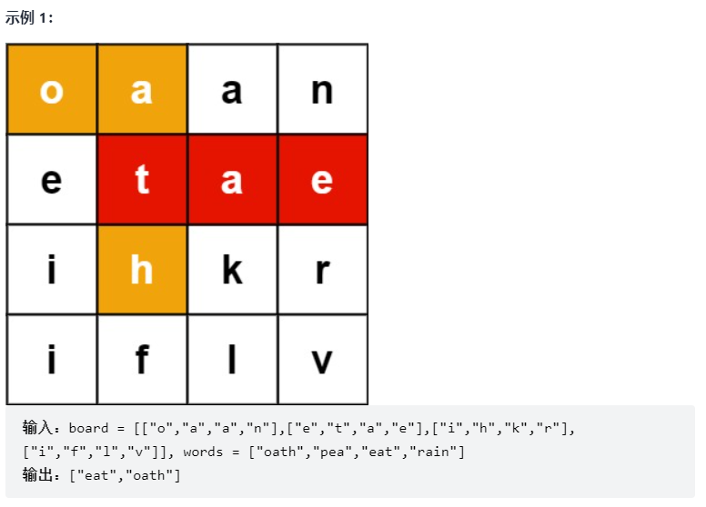

```js
let hasWord = false;

var findWords = function (board, words) {
    let ans = [];
    let m = board.length, n = board[0].length;
    for (let word of words) {
        for (let i = 0; i < m; i++) {
            for (let j = 0; j < n; j++) {
                if (board[i][j] === word[0]) {
                    hasWord = false;
                    DFS(word, board, 0, i, j, "");
                    if (hasWord) {
                        if (!ans.includes(word)) ans.push(word);
                    }
                }
            }
        }
    }
    return ans;
};

function DFS(word, board, index, i, j, subStr) {
    if (word[index] === board[i][j]) {
        subStr += board[i][j];
        // 标记已访问
        board[i][j] = "*";
        if (i < board.length - 1)
            // 向右找
            DFS(word, board, index + 1, i + 1, j, subStr);
        if (i > 0)
            // 向左找
            DFS(word, board, index + 1, i - 1, j, subStr);
        if (j < board[0].length - 1)
            // 向下找
            DFS(word, board, index + 1, i, j + 1, subStr);
        if (j > 0)
            // 向上找
            DFS(word, board, index + 1, i, j - 1, subStr);
        // 复原已访问状态
        board[i][j] = word[index];
    }
    if (index >= word.length || subStr === word) {
        hasWord = true;
    }
}
```

#### 2、矩阵中的最长递增路径

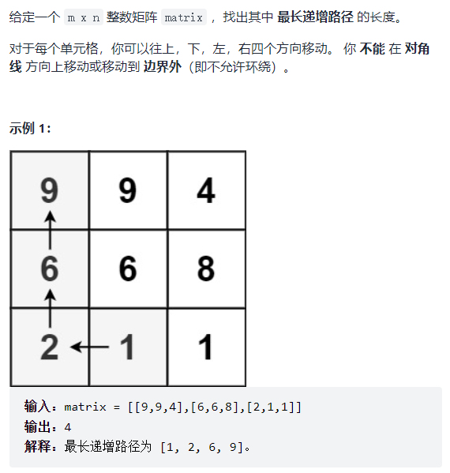

将已使用DFS查找过的长度放入**缓存**，若有其他元素通过DFS走到当前值，直接返回缓存最大值即可。

```js
// 用于进行dfs遍历，即分别向右、下、左、上进行深搜
const dirs = [[0, 1], [1, 0], [0, -1], [-1, 0]];

var longestIncreasingPath = function (matrix) {
    if (matrix.length === 0) return 0;
    const m = matrix.length, n = matrix[0].length;
    let max = 1;
    let cache = new Array(m);
    for (let i = 0; i < m; i++) {
        let child = new Array(n);
        child.fill(0);
        cache[i] = child;
    }
    
    for (let i = 0; i < m; i++) {
        for (let j = 0; j < n; j++) {
            // 对矩阵中每个元素进行一次DFS，但有缓存避免超时
            let len = dfs(matrix, i, j, m, n, cache);
            max = Math.max(max, len);
        }
    }
    return max;
};

function dfs(matrix, i, j, m, n, cache) {
    // 搜索目标：找到从当前元素matrix[i][j]开始的最长递增序列
    // cache缓存数组用于存放从当前元素matrix[i][j]开始的最长递增序列的长度
    // 当前位置cache元素不为0，意味着此位置已经遍历过，直接返回即可，避免超时
    if (cache[i][j] !== 0) return cache[i][j];
    let max = 1;
    for (let dir of dirs) {
        let x = i + dir[0], y = j + dir[1];
        if (x < 0 || x >= m || y < 0 || y >= n || matrix[x][y] <= matrix[i][j]) {
            // 当索引越界，或当前位置元素非递增时，直接退出
            continue;
        }
        
        let len = 1 + dfs(matrix, x, y, m, n, cache);
        max = Math.max(max, len);
    }
    cache[i][j] = max;
    return max;
}
```

#### 3、广度优先搜索

将从条件1到条件2的所有可能性都列出来，进行同步搜索的过程，适用于查找**最短路径**。

```
BFS() {
	1) 输入起始点
	2) 初始化所有顶点，标记为未遍历
	3) 初始化一个队列queue，并将起点放入队列
	
	while (!queue.isEmpty()) {
		从队列中删除一个顶点s，并标记为已遍历
		将s邻接的所有尚未遍历的点入队
	}
}
```

**例题：单词接龙**

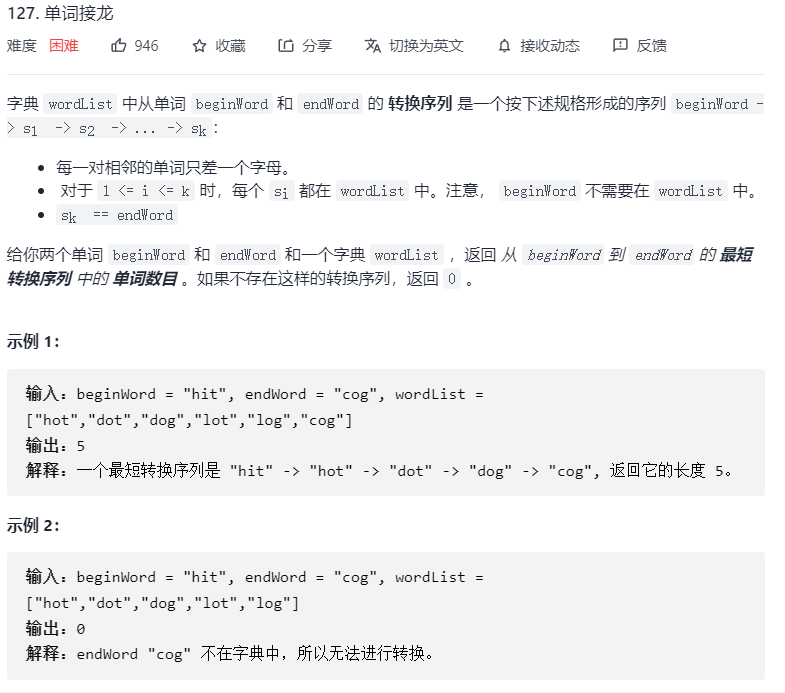

```js
var ladderLength = function (beginWord, endWord, wordList) {
    if (!wordList.includes(endWord)) return 0;
    let set = new Set(),  // 用于模拟队列，add表示入队，delete表示出队
        visited = new Set(),
        len = 1;
    
    set.add(beginWord);
    visited.add(beginWord);
    while (set.size !== 0) {
        let tmp = new Set([...set]);
        
        // 对于set中的每个单词，首先将其设为已标记，看它能不能直接转化到endWord
        // 若不能，则找到wordList中当前单词可以转化到的单词，并将它们加入到set中
        for (let w of tmp) {
            visited.add(w);
            set.delete(w);  // 从队列中删除，并标记为已访问
            
            if (changeOneChar(w, endWord)) {
                return len + 1;
            }
            for (let word of wordList) {
                // 此题中邻接的定义：当前单词w若能转换到word，即意味着word与当前单词w“邻接”
                // 将所有与w“邻接”的、且未访问的单词入队
                if (changeOneChar(w, word) && !visited.has(word)) {
                    set.add(word);
                }
            }
        }
        len++;
    }
    return 0;
};

function changeOneChar(wordA, wordB) {
    let cnt = 0;
    for (let i = 0; i < wordA.length; i++) {
        if (wordA[i] !== wordB[i]) cnt++;
        if (cnt > 1) return false;
    }
    return cnt === 1;
}
```


### 六、链表

链表从 JS 的角度来说就是一串对象使用指针连接的数据结构，通过`next`指针改变指向。

#### 1、链表排序

使用自上而下的归并算法进行排序，使用`slow.next`和`fast.next.next`两种速度获取链表节点，从而获取中间值。

```js
var sortList = function (head) {
    if (head === null || head.next === null) return head;
    
    let prev = null, slow = head, fast = head;
    while (fast !== null && fast.next !== null) {
        prev = slow;
        slow = slow.next;
        fast = fast.next.next;
    }
    prev.next = null;
    
    let l1 = sortList(head);
    let l2 = sortList(slow);
    
    return merge(l1, l2);
};

function merge(l1, l2) {
    let l = new ListNode(0), p = l;
    while (l1 !== null && l2 !== null) {
        if (l1.val < l2.val) {
            p.next = l1;
            l1 = l1.next;
        } else {
            p.next = l2;
            l2 = l2.next;
        }
        p = p.next;
    }
    
    if (l1 !== null) p.next = l1;
    if (l2 !== null) p.next = l2;
    return l.next;
}
```

#### 2、链表倒序

```js
// 迭代：时间复杂度O(n)
// 遍历时，将当前节点的next指针改为指向前一节点
// 由于节点没有引用其前一个节点，因此必须事先存储其前一个节点
// 在更改引用之前，还需要存储后一个节点
// 最后返回新的头引用
var reverseList = function (head) {
    // 一开始prev设为null是因为原链表的头结点在反转后的链表中是尾结点
    // 因此原链表头结点在反转后应指向null
    let prev = null, cur = head;
    while (cur !== null) {
        // 将当前节点指向前一节点
        let next = cur.next;
        cur.next = prev;
        // 挪到后一位置
        prev = cur;
        cur = next;
    }
    return prev;
};
```


### 七、排序

<a href="https://blog.csdn.net/Mayness/article/details/98884165">参考链接</a>

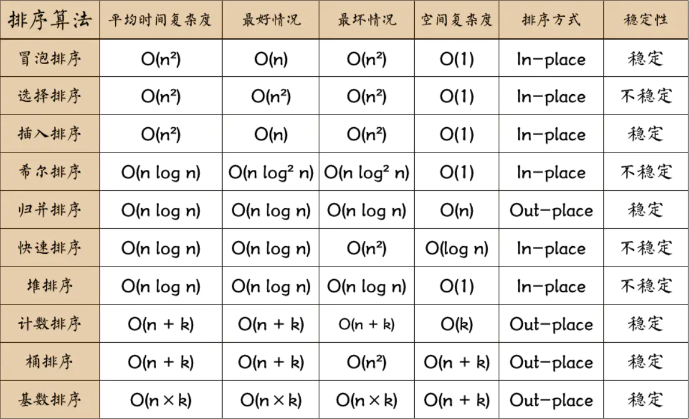

**稳定性**是指相同数据的相对位置是否改变，即在原数组中，若 $r_i=r_j\ 且\ i<j$，则排序后若 $r_i$ 仍在 $r_j$ 前面，则称此排序是稳定的。

#### 1、冒泡排序

比较任何两个相邻的项，如果前一项比后一项大，则交换它们。

平均时间复杂度：$O(n^2)$，最好情况：$O(n)$，稳定排序（数据相同时不交换）。


```js
// 初始版
var bubbleSort = function (array) {
    let ans = [...array];
    let length = array.length;
    for (let i = 0; i < length; i++) {
        for (let j = 0; j < length - 1; j++) {
            if (ans[j] > ans[j + 1]) {
                swap(j, j+1);
            }
        }
    }
    return ans;
};

// 改进版：省去不必要的比较
var bubbleSort = function (array) {
    let ans = [...array];
    let length = array.length;
    for (let i = 0; i < length; i++) {
        for (let j = 0; j < length - (i + 1); j++) {
            if (ans[j] > ans[j + 1]) {
                swap(j, j+1);
            }
        }
    }
}
```

#### 2、选择排序

找到数组中的最小值并将其放置在第一位，接着找到第二小的值并将其放在第二位，以此类推。

时间复杂度：$O(n^2)$，不稳定排序（如 arr = [5,8,5,2,9]，在第一次选择时，arr[0]和arr[3]会进行交换，此时两个相等的 5 的相对顺序发生了改变）


```js
var selectionSort = function (array) {
    let ans = [...array];
    let length = array.length, indexMin;
    for (let i = 0; i < length - 1; i++) {
        indexMin = i;
        for (let j = i; j < length; j++) {
            if (ans[indexMin] > array[j]) {
                indexMin = j;
            }
        }
        if (i !== indexMin) {
            swap(i, indexMin);
        }
    }
    return ans;
}
```

#### 3、插入排序

每次排一个数组项，以此方式构建最后的排序数组。假定第一项已经排序了，接着将其与第二项进行比较，并决定第二项应该待在原位还是插到第一项之前；头两项正确排序后，接着比较第三项，并决定第三项应该插入到第一、第二还是原位，以此类推。

平均时间复杂度：$O(n^2)$，最好情况：$O(n)$，稳定排序（不会交换相等项）


```js
var insertionSort = function (array) {
    let length = array.length, j, temp;
    let ans = [...array];
    for (let i = 1; i < length; i++) {
        j = i;
        // 现在要考虑第i项——a[i]要插入到何处，先用temp暂存该项
        temp = ans[i];
        
        // 若前一项大于该项，则将前一项往后挪，直到找到插入位置
        while (j > 0 && ans[j - 1] > temp) {
            // 将前一项挪到后一项
            ans[j] = ans[j - 1];
            j--;
        }
        
        // 插入
        ans[j] = temp;
    }
    return ans;
};
```

#### 4、希尔排序

插入排序的更高效率的实现，会优先比较距离较远的元素，希尔排序的核心在于间隔序列的设定，既可以提前设定好间隔序列，也可以动态定义间隔序列。

平均时间复杂度：$O(nlogn)$，不稳定排序。

```js
var shellSort = function (array) {
    let len = array.length, temp, gap = 1;
    while (gap < len / 3) {
        gap = gap * 3 + 1;
    }
    for (; gap > 0; gap = Math.floor(gap / 3)) {
        for (let i = gap; i < len; i++) {
            temp = arr[i];
            for (let j = i - gap; j >= 0 && array[j] > temp; j -= gap) {
                array[j + gap] = array[j];
            }
            array[j + gap] = temp;
        }
    }
    return array;
}
```

#### 5、归并排序

分治思想的典型应用，可以采用自上而下的递归和底下而上的迭代两种方式。在JS中，递归层次太深，而JS语言之前没有提供尾递归优化，可能造成栈溢出，因此采用迭代。

但是在ES6中已经添加了对尾递归优化的支持，但需要在严格模式下才能开启，尾递归优化发生时，函数调用栈会改写，在正常模式下用于跟踪函数调用栈的两个变量：`func.arguments`和`func.caller`在改写时会失真，而严格模式会禁用这两个变量。因此尾调用模式仅在严格模式下生效。

时间复杂度：$O(nlogn)$，空间复杂度：$O(n)$，空间换时间，稳定排序。


```js
var mergeSort = function (arr) {
    let len = arr.length;
    if (len < 2) return arr;
    let middle = Math.floor(len / 2),
        left = arr.slice(0, middle),
        right = arr.slice(middle);
    return merge(mergeSort(left), mergeSort(right));
};

function merge(left, right) {
    let res = [];
    while (left.length && right.length) {
        // 将左部分数组和右部分数组的首部元素进行大小比较，并将较小者弹出并放入结果数组中
        if (left[0] <= right[0]) {
            // 不会改变相等数据的相对次序
            res.push(left.shift());
        } else {
            res.push(right.shift());
        }
    }
    while (left.length) {
        res.push(left.shift());
    }
    while (right.length) {
        res.push(right.shift());
    }
    return res;
}
```

#### 6、快速排序

分治思想的典型应用，是在冒泡排序基础上的递归分治法。其内循环比大多数排序算法都要短小，主要缺点是很脆弱，实现有误差就会变成慢排序。

平均时间复杂度：$O(nlogn)$，通常情况下快于归并排序，最坏情况：$O(n^2)$

空间复杂度：$O(logn)$


- 主要流程
  1. 在数据集中选择一个元素作为基准(pivot)
  2. 对于所有小于基准的元素，都移到基准的左边；所有大于基准的元素，都移到基准的右边
  3. 当左指针大于右指针时，对基准左边和右边的两个子集，不断重复第一步和第二步，直到所有子集只剩下一个元素

- 示例（以选取第一个元素为基准值为例）
  - `var items = [6, 1, 2, 7, 9, 3, 4, 5, 10, 8]`
  - 若选择第一个元素`6`为基准值，左指针索引值为`0`，右指针索引值为`items.length-1`
  - 由于选取了第一个元素为基准值，因此先移动右指针，移动到`5`的时候，发现`5<6`，右指针停止，左指针移动；左指针移动到`7`时，发现`7>6`，左指针停止移动
  - 交换两指针所指向的值，得`[6,1,2,5,9,3,4,7,10,8]`
  - 然后，右指针接着向左移动（选择第一个元素当基准值，那么每次都要让右指针开始移动），发现`4<6`，右指针停止；左指针移动，发现`9>6`，也停止
  - 交换两指针所指向的值，得`[6,1,2,5,4,3,9,7,10,8]`
  - 然后，右指针接着向左移动，发现`3<6`，右指针停止；左指针继续向右移动，此时左指针也指向`3`，两指针相遇，说明第一次探测结束，将基准值`6`和最终值`3`进行交换，得`[3,1,2,5,4,6,9,7,10,8]`，此时以`6`为分界点，左子集的值都小于它，右子集的值都大于它，然后以`6`为分界点拆分为两个序列`[3, 1, 2, 5, 4]`和`[9, 7, 10, 8]`
  - 对于左子集序列`[3, 1, 2, 5, 4]`重复以上步骤：
    - 选基准值`3`，移动右指针到`2`处，此时`2<3`，右指针停止
    - 移动左指针到`2`处，此时左右指针相遇，将所指的值与基准值`3`进行交换得序列`[2, 1, 3, 5, 4]`，然后以`3`为分界点拆分为两个序列`[2, 1]` 和`[5, 4]`
    - 对于`[2, 1]`，交换后得`[1, 2]`
    - 对于`[5, 4]`，交换后得`[4, 5]`
    - 于是最终结果为`[1, 2, 3, 4, 5]`
  - 对于右子集序列`[9, 7, 10, 8]`重复以上步骤：
    - 选基准值`9`，移动右指针到`8`处，此时`8<9`，右指针停止
    - 移动左指针到`10`处，此时`10>9`，左指针停止
    - 交换左右指针指向的值，得`[9, 7, 8, 10]`
    - 移动右指针到`8`处，此时左右指针相遇，交换基准值得`[8, 7, 9, 10]`
    - 对于左子集序列`[8, 7]`，交换后得`[7, 8]`
    - 于是最终结果为`[7, 8, 9, 10]`
  - 于是最终结果为`[1, 2, 3, 4, 5, 6, 7, 8, 9, 10]`

```js
// 版本1：较为复杂，但内存占用小
var quickSort = function (arr, l, r) {
	let len = arr.length,
        index,  // 记录基准值的位置
        left = typeof l !== 'number' ? 0 : l,
        right = typeof r !== 'number' ? len - 1 : r;
    
    if (left < right) {
        // 获取基准值索引，以便左右分治
        index = partition(arr, left, right);
        // 基准值左侧子序列
        quickSort(arr, left, index - 1);
        // 基准值右侧子序列
        quickSort(arr, index + 1, right);
    }
    
    return arr;
};

function partition(arr, left, right) {
    // 选取第一个元素做基准值
    // index索引指向arr中待交换位置
    let pivot = left, index = pivot + 1;
    for (let i = index; i <= right; i++) {
        if (arr[i] < arr[pivot]) {
            swap(arr, i, index);
            index++;
        }
    }
    // 交换基准值和index-1位置，交换后index-1位置指向pivot
    swap(arr, pivot, index - 1);
    return index - 1;
}

function swap(arr, i, j) {
    let tmp = arr[i];
    arr[i] = arr[j];
    arr[j] = tmp;
}


// 版本2：阮一峰
// 通过遍历找到比基准值大和小的值，并存入left和right数组中，然后递归
// 易于理解，内存占用大
var quickSort = function(arr) {
    if (arr.length <= 1) return arr;
    let pivotIndex = Math.floor(arr.length / 2);  // 选择中间值为基准
    
    // 此处不能只用pivot = arr[pivotIndex]取出pivot，而是要将其分割出来，否则无限递归
    let pivot = arr.splice(pivotIndex, 1)[0];  // 从arr中去除pivot值
    let left = [], right = [];
    
    for (let i = 0; i < arr.length; i++) {
        if (arr[i] < pivot) left.push(arr[i]);
        else right.push(arr[i]);
    }
    
    return quickSort(left).concat([pivot], quickSort(right));
}
```

#### 7、堆排序

堆是一个完全二叉树，完全二叉树是指二叉树除开最后一层，其它层节点数都达到最大，且最后一层所有节点集中在左边。堆可以由数组实现，相当于对二叉树做层序遍历。

**对于节点$i$，其子节点为$2i+1$和$2i+2$**

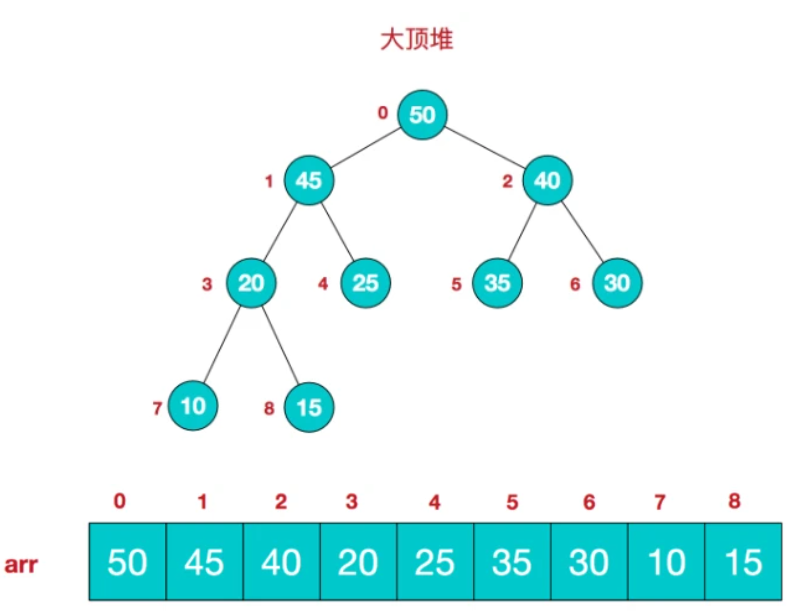

- 大顶堆：每个节点的值都大于等于其子节点的值，用于升序排列
- 小顶堆：每个节点的值都小于等于其子节点的值，用于降序排列

**堆排序算法：**

1. 将初始二叉树转化为大顶堆(heapify)，实质上是从第一个非叶节点开始从下至上、从右至左，对每个非叶节点作`shiftDown`操作，此时根节点为最大值，将其与最后一个节点交换
2. 除开最后一个节点，将其余节点组成的新堆转化为大顶堆（实际上对根节点作`shiftDown`操作），此时根节点为最大值，然后将其与最后一个节点交换
3. 重复步骤2，直到对中元素个数为1，排序完成

**图解：**

对于初始堆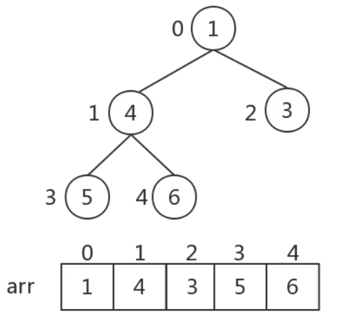

1. 初始化大顶堆，首先选取最后一个非叶结点（我们只需要调整父节点和子节点之间的大小关系，**子节点之间的大小关系无需调整**），则第一个非叶结点下标`i = Math.floor(arr.length / 2 - 1) = 1`，也就是数字`4`，找到三个数字的最大值，与父节点交换：

   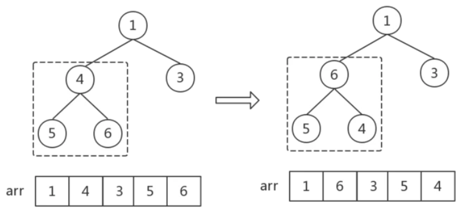

   然后，下标`i`依次减一，即从第一个非叶节点开始，从右至左，从下至上遍历所有非叶结点，后面没一次调整都是如此：找到父子节点中的最大值、做交换：

   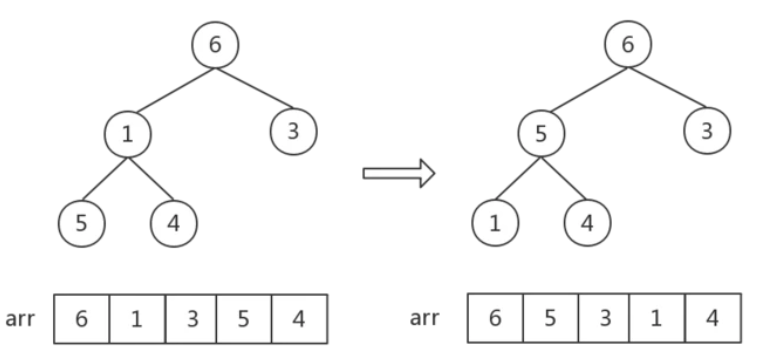

   这一步中数字`6`和`1`交换后，数字`[1, 5, 4]`组成的堆顺序不对，需要执行一步调整，需要注意：每一次对一个非叶结点作调整后，都要观察是否会影响子堆的顺序。因此将`[1, 5, 4]`子堆进行调整，最终的大顶堆见上图右侧。然后将根节点与最后一个节点交换：

   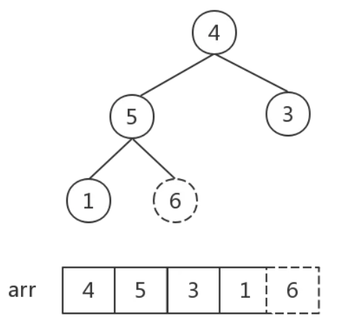

2. 除开当前最后一个节点`6`（即最大值），将其余节点`[4, 5, 3, 1]`组成的新堆转化为大顶堆：

   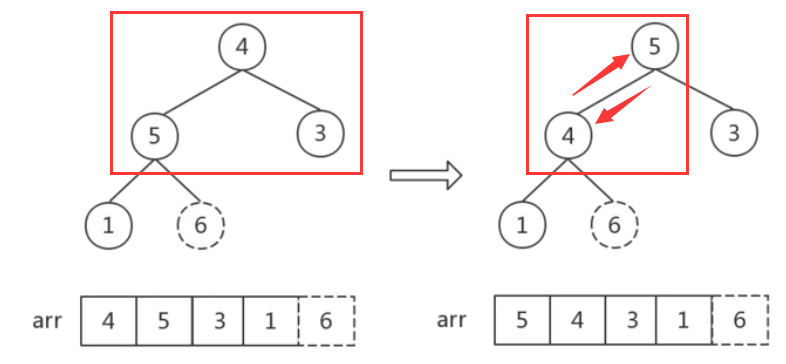

   将根节点与最后一个节点`1`进行交换：

   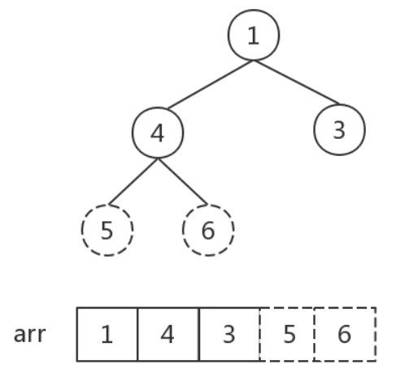

3. 反复执行步骤2，直到对中元素个数为1：

   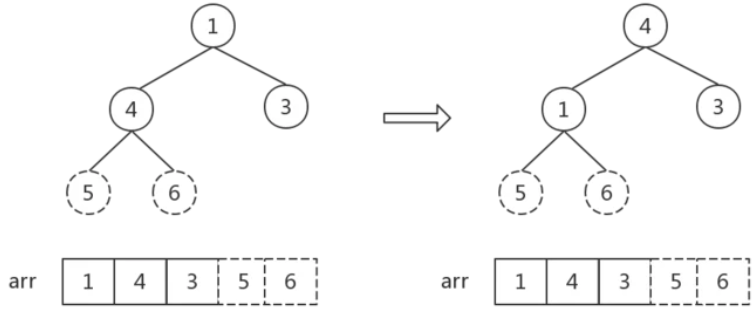

   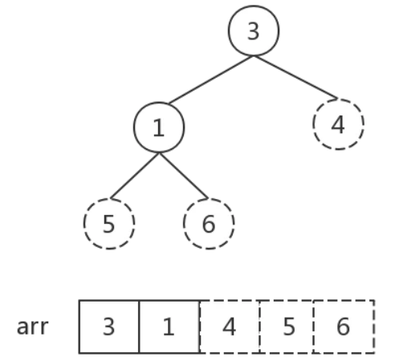

   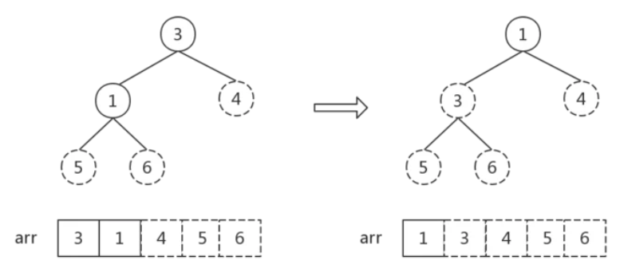
   
   

```js
// 交换两个节点
function swap(A, i, j) {
  let temp = A[i];
  A[i] = A[j];
  A[j] = temp; 
}

/*
将 i 结点以下的堆整理为大顶堆，注意这一步实现的基础实际上是：假设 结点 i 以下的子堆已经是一个大顶堆，shiftDown函数实现的功能是实际上是：找到 结点 i 在包括结点 i 的堆中的正确位置。后面将写一个 for 循环，从第一个非叶子结点开始，对每一个非叶子结点都执行 shiftDown操作，所以就满足了结点 i 以下的子堆已经是一大顶堆
*/
function shiftDown(A, i, length) {
  let temp = A[i]; // 当前父节点
  // j<length 的目的是对结点 i 以下的结点全部做顺序调整
  for(let j = 2*i+1; j < length; j = 2*j+1) {
    temp = A[i];  // 将 A[i] 取出，整个过程相当于找到 A[i] 应处于的位置
    if (j + 1 < length && A[j] < A[j+1]) { 
      j++;   // 找到两个孩子中较大的一个，再与父节点比较
    }
    if(temp < A[j]) {
      swap(A, i, j) // 如果父节点小于子节点:交换；否则跳出
      i = j;  // 定位当前父节点换到的位置，以便后续swap
    } else {
      break;
    }
  }
}

// 堆排序
function heapSort(A) {
  // 初始化大顶堆，从第一个非叶子结点开始一直到根节点，都要进行调整
  // 第一个非叶结点取A[len/2 - 1]，可以考虑len = 2的极端情况，此时从根节点开始
  for(let i = Math.floor(A.length/2 - 1); i >= 0; i--) {
    // 从最后一个非叶结点开始，向上、向右，每个非叶结点都要下滤
    shiftDown(A, i, A.length);
  }
    
  // 排序，for的每次循环都将大顶堆的根节点和最后一个节点对换，然后下滤将堆重新调整为大顶堆
  for(let i = A.length - 1; i>0; i--) {
    swap(A, 0, i); // 根节点与最后一个节点交换
    shiftDown(A, 0, i); // 从根节点开始调整，并且最后一个结点已经为当前最大值，不需要再参与比较，所以第三个参数为 i，即比较到最后一个结点前一个即可
  }
}

let Arr = [4, 6, 8, 5, 9, 1, 2, 5, 3, 2];
heapSort(Arr);
alert(Arr);
```

#### 8、计数排序

核心在于将输入的数据值转化为键存储在额外开辟的数组空间中，作为一种线性时间复杂度的排序，计数排序要求输入的数据必须是有确定范围的整数，以便额外开辟数组进行计数。

时间复杂度：$O(n+k)$，空间复杂度：$O(k)$

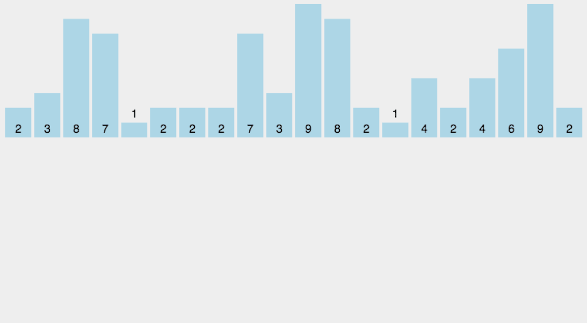

```js
function countingSort(arr, maxValue) {
    // maxValue为给定数据中的最大值
    let bucket = new Array(maxValue + 1),
        sortedIndex = 0,
        arrLen = arr.length,
        bucketLen = maxValue + 1;
    for (let i = 0; i < arrLen; i++) {
        if (!bucket[arr[i]])  bucket[arr[i]] = 0;
        bucket[arr[i]]++;
    }
    for (let j = 0; j < bucketLen; j++) {
        while (bucket[j] > 0) {
            arr[sortedIndex++] = j;
            bucket[j]--;
        }
    }
    return arr;
}
```

#### 9、桶排序

是计数排序的升级版，利用函数和映射关系，高效与否的关键在于这个映射函数的确定。为了使桶排序更加高效，我们需要做到这两点：

- 在额外空间充足的情况下，尽量增大桶的数量
- 使用的映射函数能够将输入的N个数据均匀分配到K个桶中

**最好情况**：输入的数据可以均匀分布到每个桶中，$O(n+k)$

**最坏情况**：输入的数据被分配到了同一个桶中，$O(n^2)$

```js
function bucketSort(arr, bucketSize) {
    if (arr.length === 0) return arr;
    
    let i, minValue = arr[0], maxValue = arr[0];
    // 取得数组中的两个最值
    for (i = 1; i < arr.length; i++) {
        if (arr[i] < minValue) {
            minValue = arr[i];
        } else if (arr[i] > maxValue) {
            maxValue = arr[i];
        }
    }
    
    // 桶初始化
    const DEFAULT_BUCKET_SIZE = 5;  // 设置桶的默认容量为5
    // 两数作逻辑或时，保留较小者
    bucketSize = bucketSize || DEFAULT_BUCKET_SIZE;
    // 桶的数量
    let bucketCount = Math.floor((maxValue - minValue) / bucketSize) + 1;
    let buckets = new Array(bucketCount);
    for (i = 0; i < arr.length; i++) {
        bucket[i] = [];
    }
    
    // 利用映射函数将数据分配到各个桶中
    for (i = 0; i < arr.length; i++) {
        buckets[Math.floor((arr[i] - minValue) / bucketSize)].push(arr[i]);
    }
    arr.length = 0;
    for (i = 0; i < buckets.length; i++) {
        // 对每个桶内进行排序，这里使用插入排序
        insertionSort(buckets[i]);
        for (let j = 0; j < buckets[i].length; j++) {
            arr.push(buckets[i][j]);
        }
    }
    return arr;
}
```

#### 10、基数排序(Radix Sort)

有两种：MSD - 从高位开始进行排序；LSD - 从低位开始进行排序

- 基数排序：根据**键值的每位数字**来分配桶（如LSD，从个位开始）
- 计数排序：每个桶只存储单一键值
- 桶排序：每个桶存储一定范围的数值

LSD计数排序示意图：

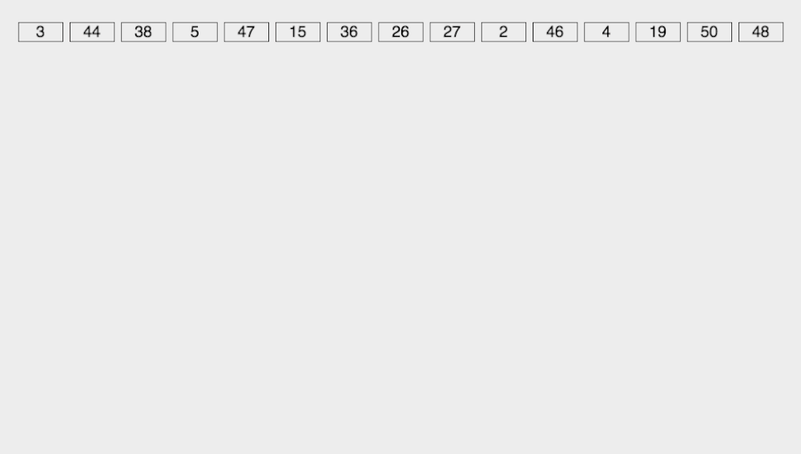

```js
// LSD
// counter用于存放一系列的桶
var counter = [];
function radixSort(arr, maxDigit) {
    // maxDigit: 最高到多少位
    let mod = 10;
    let dev = 1;
    for (let i = 0; i < maxDigit; i++, dev *= 10, mod *= 10) {
        for (let j = 0; j < arr.length; j++) {
            // 找到每一位对应的桶，并将arr[j]放入桶counter中
            let bucket = parseInt((arr[j] % mod) / dev);
            if (counter[bucket] === null) counter[bucket] = [];
            counter[bucket].push(arr[j]);
        }
        let pos = 0;
        for (let j = 0; j < counter.length; j++) {
            // 从桶中依次取出数据
            let value = null;
            if (counter[j] !== null) {
                while ( (value = counter[j].shift()) !== null ) {
                    arr[pos++] = value;
                }
            }
        }
    }
    return arr;
}
```


### 八、排序例题

#### 1、游戏中弱角色的数量

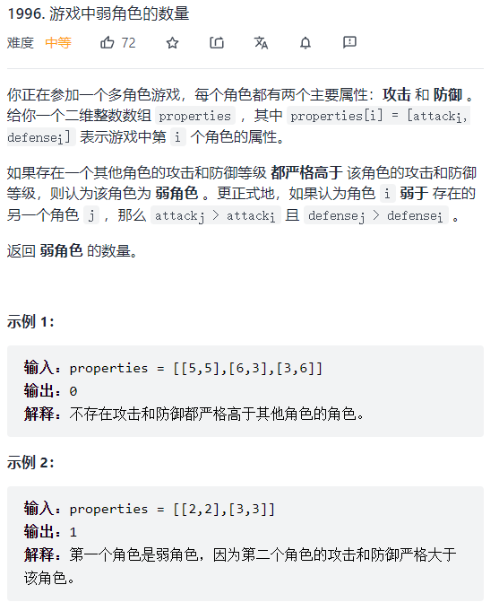

思路：

- 将properties数组中的元素进行排序，排序规则：优先以降序排列攻击力，若攻击力相同，则以升序排列防御力
- 从头开始遍历排序后的properties数组，并记录当前时刻遍历到的最大防御力值，因为攻击力是按降序排序，因此遍历到每个元素时只需要比较该元素的防御力与最大防御力值，若小于，则当前元素为一个弱角色
- 当遍历到连续多个攻击力相同的元素时，为了避免将它们中防御力较小的那些元素误计入结果中，因此先前排序时需要以升序排列防御力，这样保证了最大防御力值（若发生更新）会在一系列攻击力相同的角色的最后一个（即防御力最大的那个）处更新

此题也可以考虑使用单调栈。

```js
var numberOfWeakCharacters = function(properties) {
    properties.sort((o1, o2) => {
        return o1[0] === o2[0] ? (o1[1] - o2[1]) : (o2[0] - o1[0]);
    });
    let maxDef = 0;
    let ans = 0;
    for (const p of properties) {
        if (p[1] < maxDef) {
            ans++;
        } else {
            maxDef = p[1];
        }
    }
    return ans;
};
```

#### 2、求数组中第K大的值

使用选择排序排列了前K个值得到结果。

```js
var findKthLargest = function (nums, k) {
    for (let i = 0; i <= k; i++) {
        let max = i;
        for (let j = 0; j < nums.length; j++) {
            if (nums[j] > nums[max]) max = j;
        }
        swap(nums, i, max);
    }
    return nums[k - 1];
};

function swap(arr, i, j) {
    let tmp = arr[i];
    arr[i] = arr[j];
    arr[j] = tmp;
}
```

#### 3、对有重复值的数组进行排序

有重复值数组采用三项切分的快速排序，也可以使用计数排序。

```js
var sortColors = function (nums) {
    sort(nums, 0, nums.length - 1);
};

function sort(arr, lo, hi) {
    /*
    三项切分快速排序主体：类似于快速排序，优化点在于如果某个元素等于切分元素
    元素位置不变，最后小于切分元素的到左边，等于切分元素的根据数量放在中间
    大于切分元素的放在右边
    */
    if (hi <= lo) return;
    
    let lt = lo,
        i = lo + 1,  // 左指针
        gt = hi;	 // 右指针
    let v = arr[lo];
    
    while (i <= gt) {
        if (arr[i] < v) swap(arr, lt++, i++);
        else if (arr[i] > v) swap(arr, i, gt--);
        else i++;
    }
    
    sort(arr, lo, lt - 1);
    sort(arr, gt + 1, hi);
}

function swap(arr, a, b) {
    let x = arr[a];
    arr[a] = arr[b];
    arr[b] = x;
}
```


### 九、算数例题

注意事项：如果使用累加、累乘等常数级别增长，可能出现超时，因此需要指数级别增长来找到结果。

#### 1、计算 $x^n$

- 累乘：$x\times x\times \dots\times x$
- 转换为指数级增长：$2^9=2\times4^4=2\times16^2=2\times256=512$，对于 $x^n$：
  - 若 n % 2 !== 0，即 n 为奇数，则 $x^n = x \times(x^2\times x^{\lfloor\frac{n}{2}\rfloor})$
  - 否则，$x^n=x^2\times x^{\frac{n}{2}}$

```js
var xPow = function (x, n) {
    if (n === 0) return 1;
    if (n < 0) {
        n = -n;
        x = 1 / x;
    }
    return (n % 2 === 0) ?
        xPow(x * x, n / 2) :
    	x * xPow(x * x, parseInt(n / 2));
}
```

#### 2、求 $\sqrt{x}$

使用二分法。

```js
var xSqrt = function (x) {
    let l = 0, r = x;
    while (true) {
        let mid = l + parseInt(l + (r - l) / 2);
        if (mid * mid > x) {
            r = mid - 1;
        } else if (mid * mid < x) {
            if ( (mid + 1) * (mid + 1) > x )  return mid;
            l = mid + 1;
        } else return mid;
    }
}
```


#### 十、二进制问题

一般用按位运算符和二进制转换 `Number.parseInt()` 和 `Number.prototype.toString()` 解决。

#### 1、将一个32位数字的二进制进行倒序

**利用库函数：**

```js
var reverseBits = function(n) {
    let t = n.toString(2).split("");	// 转为数组
    while (t.length < 32) t.unshift("0");  // 数组头部添0凑够32位
    return parseInt(t.reverse().join(""), 2);
}
```

**位运算分治：**

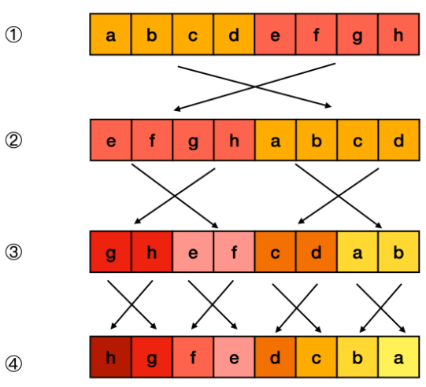

- 若要翻转一个二进制串，可以将其均分成左右两部分，对每部分递归执行翻转操作，然后将左半部分拼在右半部分的后面，即完成了翻转。


- 由于左右两部分的计算方式是相似的，利用位掩码和位移运算，我们可以自底向上地完成这一分治流程。


- 对于递归的最底层，我们需要交换所有奇偶位：
  - 取出所有奇数位和偶数位；
  - 将奇数位移到偶数位上，偶数位移到奇数位上。
  - 类似地，对于倒数第二层，每两位分一组，按组号取出所有奇数组和偶数组，然后将奇数组移到偶数组上，偶数组移到奇数组上。以此类推。

- 需要注意的是，在某些语言（如 Java）中，没有无符号整数类型，因此对 n 的右移操作应使用逻辑右移。


```js
var reverseBits = function(n) {
    const M1 = 0x55555555; // 01010101010101010101010101010101
    const M2 = 0x33333333; // 00110011001100110011001100110011
    const M4 = 0x0f0f0f0f; // 00001111000011110000111100001111
    const M8 = 0x00ff00ff; // 00000000111111110000000011111111

    // >>> 为以0填充的右位移
    n = n >>> 1 & M1 | (n & M1) << 1;
    n = n >>> 2 & M2 | (n & M2) << 2;
    n = n >>> 4 & M4 | (n & M4) << 4;
    n = n >>> 8 & M8 | (n & M8) << 8;
    return (n >>> 16 | n << 16) >>> 0;
};
```

