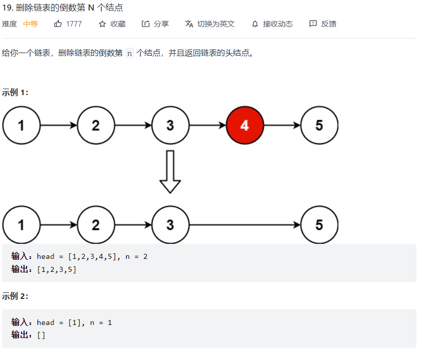

链表从 JS 的角度来说就是一串对象使用指针连接的数据结构，通过`next`指针改变指向。

#### 1、链表排序

使用自上而下的归并算法进行排序，使用`slow.next`和`fast.next.next`两种速度获取链表节点，从而获取中间值。

```js
var sortList = function (head) {
    if (head === null || head.next === null) return head;
    
    let prev = null, slow = head, fast = head;
    while (fast !== null && fast.next !== null) {
        prev = slow;
        slow = slow.next;
        fast = fast.next.next;
    }
    prev.next = null;
    
    let l1 = sortList(head);
    let l2 = sortList(slow);
    
    return merge(l1, l2);
};

function merge(l1, l2) {
    let l = new ListNode(0), p = l;
    while (l1 !== null && l2 !== null) {
        if (l1.val < l2.val) {
            p.next = l1;
            l1 = l1.next;
        } else {
            p.next = l2;
            l2 = l2.next;
        }
        p = p.next;
    }
    
    if (l1 !== null) p.next = l1;
    if (l2 !== null) p.next = l2;
    return l.next;
}
```

#### 2、链表倒序

```js
// 迭代：时间复杂度O(n)
// 遍历时，将当前节点的next指针改为指向前一节点
// 由于节点没有引用其前一个节点，因此必须事先存储其前一个节点
// 在更改引用之前，还需要存储后一个节点
// 最后返回新的头引用
var reverseList = function (head) {
    // 一开始prev设为null是因为原链表的头结点在反转后的链表中是尾结点
    // 因此原链表头结点在反转后应指向null
    let prev = null, cur = head;
    while (cur !== null) {
        // 将当前节点指向前一节点
        let next = cur.next;
        cur.next = prev;
        // 挪到后一位置
        prev = cur;
        cur = next;
    }
    return prev;
};
```

#### 3、双指针法



```js
/**
 * Definition for singly-linked list.
 * function ListNode(val, next) {
 *     this.val = (val===undefined ? 0 : val)
 *     this.next = (next===undefined ? null : next)
 * }
 */
var removeNthFromEnd = function(head, n) {
    const dummy = new ListNode(0, head);
    let first = head;
    let second = dummy;

    // 让右指针领先左指针n步，这样当右指针到头时，左指针指向的节点.next即为要删除的倒数第N个节点
    for (let i = 0; i < n; i++) {
        first = first.next;
    }

    while (first !== null) {
        first = first.next;
        second = second.next;
    }

    second.next = second.next.next;
    return dummy.next;
};
```

