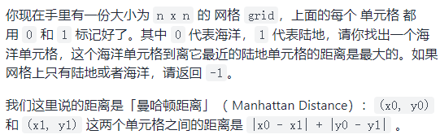
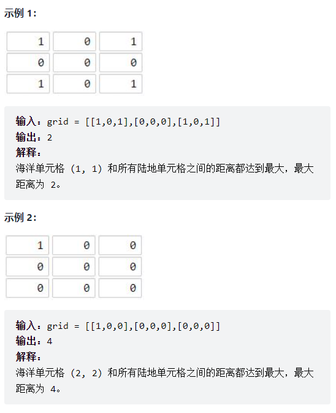
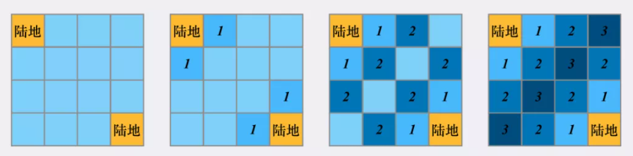
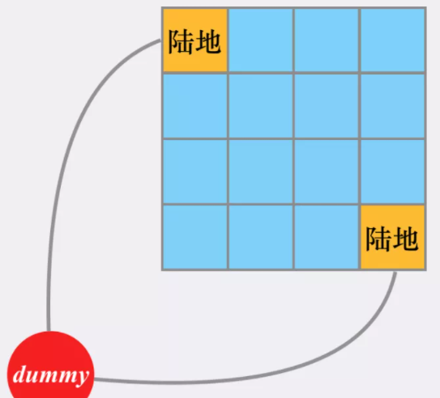
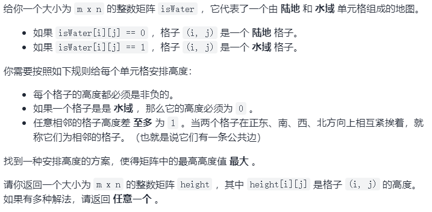
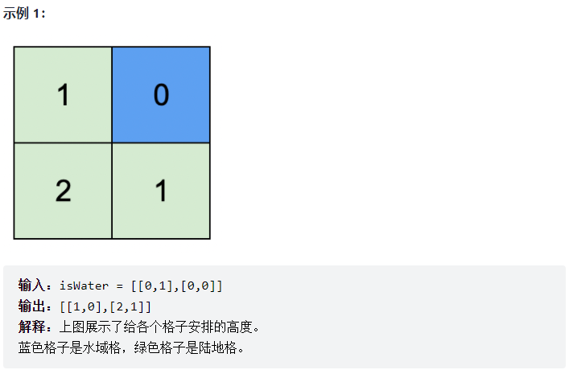
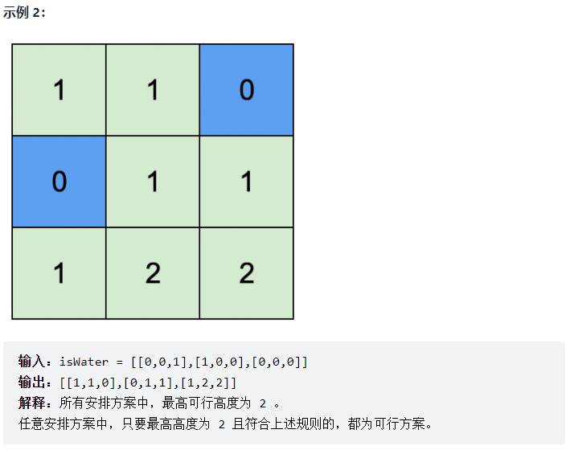
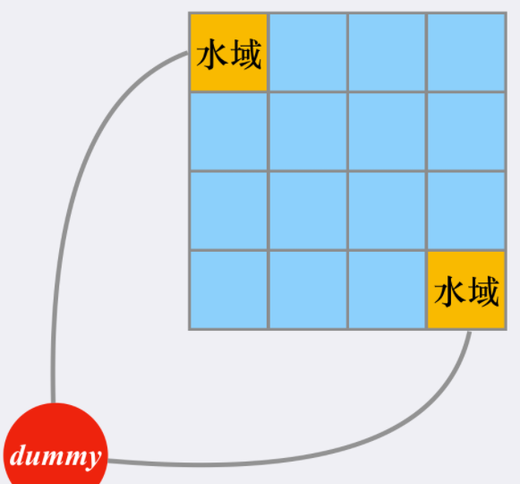
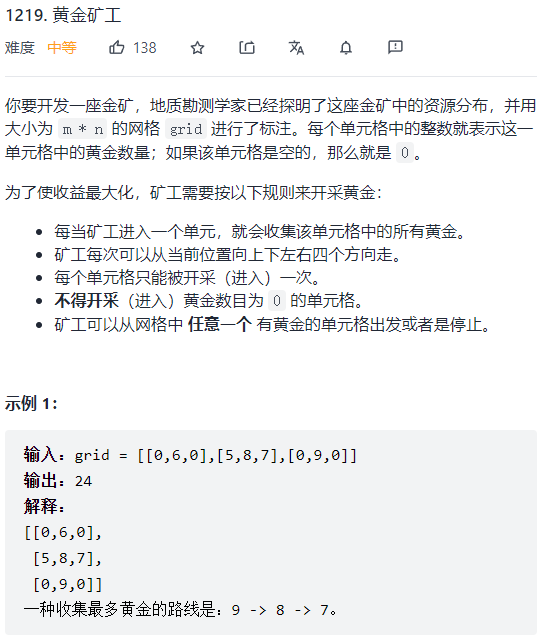

路径题可用DFS、BFS进行求解，通过递归将走过的路径进行标记来不断往前找到目标路径。

**DFS解题过程范式：**

1. 判断当前位置是否合法，如果被访问过或者越界，不用继续考虑
2. 判断当前位置是否和目标字符串的pos位置字符匹配
3. 判断匹配的pos是不是已经是最后一个位置，如果是，说明我们已经完成这次匹配，可以直接返回
4. 如果匹配我们先标记当前位置已经访问过（如给该位置设为「*」），然后继续遍历相邻的搜索空间
5. 最后清理现场，将已经访问等状态复原（将设为「*」的元素复原）

```
DFS (顶点v) {
    1) 标记v为已遍历
    2) for (对于每个邻接于顶点v且未标记的点u) {
           DFS(u);
       }
    3) 恢复v的标记
}
```


#### 1、单词搜索

给定一个 m x n 二维字符网格 board 和一个单词（字符串）列表 words，返回所有二维网格上的单词。单词必须按照字母顺序，通过 相邻的单元格 内的字母构成，其中“相邻”单元格是那些水平相邻或垂直相邻的单元格。同一个单元格内的字母在一个单词中不允许被重复使用。


```js
let hasWord = false;

var findWords = function (board, words) {
    let ans = [];
    let m = board.length, n = board[0].length;
    for (let word of words) {
        for (let i = 0; i < m; i++) {
            for (let j = 0; j < n; j++) {
                if (board[i][j] === word[0]) {
                    hasWord = false;
                    DFS(word, board, 0, i, j, "");
                    if (hasWord) {
                        if (!ans.includes(word)) ans.push(word);
                    }
                }
            }
        }
    }
    return ans;
};

function DFS(word, board, index, i, j, subStr) {
    if (word[index] === board[i][j]) {
        subStr += board[i][j];
        // 标记已访问
        board[i][j] = "*";
        if (i < board.length - 1)
            // 向右找
            DFS(word, board, index + 1, i + 1, j, subStr);
        if (i > 0)
            // 向左找
            DFS(word, board, index + 1, i - 1, j, subStr);
        if (j < board[0].length - 1)
            // 向下找
            DFS(word, board, index + 1, i, j + 1, subStr);
        if (j > 0)
            // 向上找
            DFS(word, board, index + 1, i, j - 1, subStr);
        // 复原已访问状态
        board[i][j] = word[index];
    }
    if (index >= word.length || subStr === word) {
        hasWord = true;
    }
}
```

#### 2、矩阵中的最长递增路径


将已使用DFS查找过的长度放入**缓存**，若有其他元素通过DFS走到当前值，直接返回缓存最大值即可。

```js
// 用于进行dfs遍历，即分别向右、下、左、上进行深搜
const dirs = [[0, 1], [1, 0], [0, -1], [-1, 0]];

var longestIncreasingPath = function (matrix) {
    if (matrix.length === 0) return 0;
    const m = matrix.length, n = matrix[0].length;
    let max = 1;
    let cache = new Array(m);
    for (let i = 0; i < m; i++) {
        let child = new Array(n);
        child.fill(0);
        cache[i] = child;
    }
    
    for (let i = 0; i < m; i++) {
        for (let j = 0; j < n; j++) {
            // 对矩阵中每个元素进行一次DFS，但有缓存避免超时
            let len = dfs(matrix, i, j, m, n, cache);
            max = Math.max(max, len);
        }
    }
    return max;
};

function dfs(matrix, i, j, m, n, cache) {
    // 搜索目标：找到从当前元素matrix[i][j]开始的最长递增序列
    // cache缓存数组用于存放从当前元素matrix[i][j]开始的最长递增序列的长度
    // 当前位置cache元素不为0，意味着此位置已经遍历过，直接返回即可，避免超时
    if (cache[i][j] !== 0) return cache[i][j];
    let max = 1;
    for (let dir of dirs) {
        let x = i + dir[0], y = j + dir[1];
        if (x < 0 || x >= m || y < 0 || y >= n || matrix[x][y] <= matrix[i][j]) {
            // 当索引越界，或当前位置元素非递增时，直接退出
            continue;
        }
        
        let len = 1 + dfs(matrix, x, y, m, n, cache);
        max = Math.max(max, len);
    }
    cache[i][j] = max;
    return max;
}
```

#### 3、广度优先搜索

将从条件1到条件2的所有可能性都列出来，进行同步搜索的过程，适用于查找**最短路径**。

```
BFS() {
	1) 输入起始点
	2) 初始化所有顶点，标记为未遍历
	3) 初始化一个队列queue，并将起点放入队列
	
	while (!queue.isEmpty()) {
		从队列中删除一个顶点s，并标记为已遍历
		将s邻接的所有尚未遍历的点入队
	}
}
```

**例题：单词接龙**


```js
var ladderLength = function (beginWord, endWord, wordList) {
    if (!wordList.includes(endWord)) return 0;
    let set = new Set(),  // 用于模拟队列，add表示入队，delete表示出队
        visited = new Set(),
        len = 1;
    
    set.add(beginWord);
    visited.add(beginWord);
    while (set.size !== 0) {
        let tmp = new Set([...set]);
        
        // 对于set中的每个单词，首先将其设为已标记，看它能不能直接转化到endWord
        // 若不能，则找到wordList中当前单词可以转化到的单词，并将它们加入到set中
        for (let w of tmp) {
            visited.add(w);
            set.delete(w);  // 从队列中删除，并标记为已访问
            
            if (changeOneChar(w, endWord)) {
                return len + 1;
            }
            for (let word of wordList) {
                // 此题中邻接的定义：当前单词w若能转换到word，即意味着word与当前单词w“邻接”
                // 将所有与w“邻接”的、且未访问的单词入队
                if (changeOneChar(w, word) && !visited.has(word)) {
                    set.add(word);
                }
            }
        }
        len++;
    }
    return 0;
};

function changeOneChar(wordA, wordB) {
    let cnt = 0;
    for (let i = 0; i < wordA.length; i++) {
        if (wordA[i] !== wordB[i]) cnt++;
        if (cnt > 1) return false;
    }
    return cnt === 1;
}
```

#### 4、单源BFS和多源BFS

**例题1：地图分析**





**思路1 - 单源BFS：**

从某起点出发，求解到达终点的最短距离。对于本题，如果套用单源最短路方法，需要对每个「海洋」位置做一次BFS，求得每个「海洋」的最近陆地距离，然后在所有距离中取「max」作为答案。

单次BFS的最坏情况是需要扫描完整个矩阵，复杂度为 $O(n^2)$。

同时，最多有 $n^2$ 个海洋区域需要做BFS，因此此做法复杂度为 $O(n^4)$，且可以直接取满，复杂度较高。

一些细节：为了方便，我们在使用哈希表记录距离时，将二维坐标 $(x,y)$ 转化为对应的一维下标 $idx = x\times n+y$ 进行存储。

```js
var dirs = [ [1,0], [-1,0], [0,1], [0,-1] ];
var grid, n;

var maxDistance = function (_grid) {
    grid = _grid;
    n = _grid.length;
    let ans = -1;
    for (let i = 0; i < n; i++) {
        for (let j = 0; j < n; j++) {
            if (grid[i][j] === 0) {
                // 海洋处
                ans = Math.max(ans, bfs(i, j));
            }
        }
    }
    return ans;
};

// 单源BFS：求解海洋位置(x,y)最近的陆地距离
function bfs(x, y) {
    let map = new Map(),  // 用于记录映射：(x,y) -> distanceToLand，兼标记功能
        set = new Set();  // 用于模拟队列
    
    set.add([x, y]);  // 当前海洋坐标入队
    map.set(x * n + y, 0);  // 标记
    while (set.size !== 0) {
        let tmp = new Set([...set]);

        for (let poll of tmp) {
            set.delete(poll);  // 出队
            let dx = poll[0], dy = poll[1];
            let step = map.get(dx * n + dy);
            
            if (grid[dx][dy] === 1)  return step;
            
            for (let di of dirs) {
                // 东西南北的邻接点
                let nx = dx + di[0], ny = dy + di[1];
                if (nx < 0 || nx >= n || ny < 0 || ny >= n) continue;
                let key = nx * n + ny;
                if (map.has(key)) continue; // 跳过已遍历点
                set.add([nx, ny]);  // 否则邻接点入队
                map.set(key, step + 1);  // 标记已遍历并添加映射
            }
        }
    }
    return -1;
}
```

**思路2 - 多源BFS：**

与单源最短路不同，多源最短路是从「多个源点」到达「一个/多个汇点」的最短路径。核心搜索部分并无区别，并可以通过建立「虚拟源点」的方式，将多源BFS转换回单源BFS问题。

**多源就是要从坐标值已知且固定的那些「真实源点」出发。**

以本题为例，可以将「源点」和「汇点」进行反转：**从每个「陆地」区域出发，多个「陆地」区域每次同时向外扩散一圈，每个「海洋」区域首次被覆盖时所对应的圈数，就是「海洋」区域距离最近的陆地区域的距离。**



可以想象存在一个「虚拟源点」，它与所有「真实源点」（陆地）存在等权的边，那么任意「海洋」区域与最近的陆地区域的最短路等价于与「虚拟源点」的最短路：



实现上，不需要建立虚拟源点，只需要在BFS前将所有「真实源点」进行入队即可。这个过程相当于从队列中弹出「虚拟源点」，并把它相邻的所有「真实源点」（所有陆地点）进行入队，然后进行常规的BFS。

一些细节：为了实现上方便，在进行常规BFS时，如果一个「海洋」区域被访问到，说明它被离它最近的「陆地」覆盖到了，修改值为最小距离。这样只需考虑那些值仍然为 0 的海洋区域即可。

时间复杂度、空间复杂度：$O(n^2)$

```js
var dirs = [ [1,0], [-1,0], [0,1], [0,-1] ];
var grid, n;

var maxDistance = function (_grid) {
    grid = _grid;
    n = _grid.length;
    let set = new Set(),
        map = new Map();
    for (let i = 0; i < n; i++) {
        for (let j = 0; j < n; j++) {
            if (grid[i][j] === 1) {
                set.add([i, j]);
                map.set(i * n + j, 0);
            }
        }
    }
    
    let ans = -1;
    while (set.size !== 0) {
        let tmp = new Set([...set]);

        for (let poll of tmp) {
            set.delete(poll);  // 从队列中删除，并标记为已访问
            let dx = poll[0], dy = poll[1];
            let step = map.get(dx * n + dy);
			
            for (let di of dirs) {
				let nx = dx + di[0], ny = dy + di[1];
                if (nx < 0 || nx >= n || ny < 0 || ny >= n) continue;
                if (grid[nx][ny] !== 0) continue;
                grid[nx][ny] = step + 1;
                set.add([nx, ny]);
                map.set(nx * n + ny, step + 1);
                ans = Math.max(ans, step + 1);
            }
        }
    }
    
    return ans;
};
```


**例题2：地图中的最高点**







水域区域高度为0，相邻格子高度差最多为1，可以将所有水域区域入队，然后跑一遍BFS（多源）即可。将所有水域区域进行入队的操作可看做是将与「虚拟源点」链接的节点进行入队。



对于一个陆地区域而言，它能填入的高度，取决于其与其他水域区域的距离，每个陆地区域应该取其能填入高度的下界，即只由距离它最近的水域区域更新。

```js
var dirs = [ [1,0], [-1,0], [0,1], [0,-1] ];
var highestPeak = function (g) {
    let m = g.length, n = g[0].length;
    let ans = [],
        set = new Set();
    
    for (let i = 0; i < m; i++) {
        ans.push(new Array(n));
    }
    
    for (let i = 0; i < m; i++) {
        for (let j = 0; j < n; j++) {
            if (g[i][j] === 1)  set.add([i, j]);  // 所有水域格子入队
            ans[i][j] = g[i][j] === 1 ? 0 : -1;	  // ans兼有记录结果和标记已遍历的作用
        }
    }
    
    while (set.size !== 0) {
        let tmp = new Set([...set]);
        for (let poll of tmp) {
            set.delete(poll);	// 出队
            let dx = poll[0], dy = poll[1];
            for (let dir of dirs) {
                // 找邻接点
                let nx = dx + dir[0], ny = dy + dir[1];
                if (nx < 0 || nx >= m || ny < 0 || ny >= n) continue;
                if (ans[nx][ny] !== -1) continue;  // 已访问过则直接跳过
                ans[nx][ny] = ans[dx][dy] + 1;	   // 邻接点必然比上一个点的高度大1
                set.add([nx, ny]);  // 邻接点入队
            }
        }
    }
    return ans;
}
```


#### 5、回溯



对每个非 0 元素进行回溯 DFS，找到最大的采矿路径。

```js
/**
 * @param {number[][]} grid
 * @return {number}
 */

var getMaximumGold = function(grid) {
    const m = grid.length, n = grid[0].length;
    this.grid = grid;
    this.ans = 0;
    this.dirs = [[-1,0],[1,0],[0,-1],[0,1]]

    const dfs = function (i, j, sum) {
        sum = grid[i][j] + sum;
        ans = Math.max(ans, sum);
        let tmp = grid[i][j];
        grid[i][j] = 0;
        for (let di of dirs) {
            const ni = i + di[0], nj = j + di[1];
            if (ni >= 0 && nj >= 0 && ni < m && nj < n && grid[ni][nj] > 0) {
                dfs(ni, nj, sum);
            }
        }
        grid[i][j] = tmp;
    }

    for (let i = 0; i < m; i++) {
        for (let j = 0; j < n; j++) {
            if (grid[i][j] !== 0) dfs(i, j, 0);
        }
    }

    return ans;
};
```

