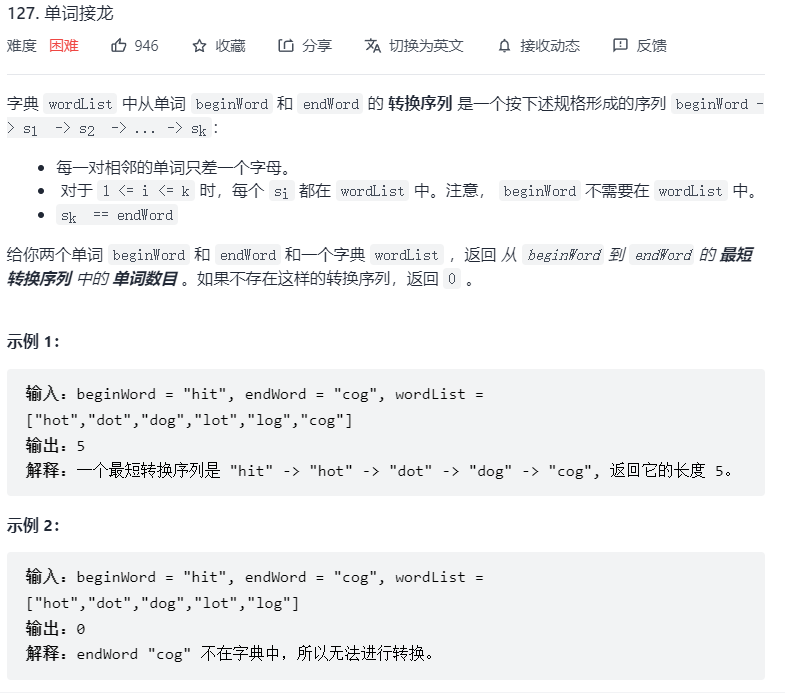

路径题可用DFS、BFS进行求解，通过递归将走过的路径进行标记来不断往前找到目标路径。

**DFS解题过程范式：**

1. 判断当前位置是否合法，如果被访问过或者越界，不用继续考虑
2. 判断当前位置是否和目标字符串的pos位置字符匹配
3. 判断匹配的pos是不是已经是最后一个位置，如果是，说明我们已经完成这次匹配，可以直接返回
4. 如果匹配我们先标记当前位置已经访问过（如给该位置设为「*」），然后继续遍历相邻的搜索空间
5. 最后清理现场，将已经访问等状态复原（将设为「*」的元素复原）

```
DFS (顶点v) {
    1) 标记v为已遍历
    2) for (对于每个邻接于顶点v且未标记的点u) {
           DFS(u);
       }
    3) 恢复v的标记
}
```


#### 1、单词搜索

给定一个 m x n 二维字符网格 board 和一个单词（字符串）列表 words，返回所有二维网格上的单词。单词必须按照字母顺序，通过 相邻的单元格 内的字母构成，其中“相邻”单元格是那些水平相邻或垂直相邻的单元格。同一个单元格内的字母在一个单词中不允许被重复使用。


```js
let hasWord = false;

var findWords = function (board, words) {
    let ans = [];
    let m = board.length, n = board[0].length;
    for (let word of words) {
        for (let i = 0; i < m; i++) {
            for (let j = 0; j < n; j++) {
                if (board[i][j] === word[0]) {
                    hasWord = false;
                    DFS(word, board, 0, i, j, "");
                    if (hasWord) {
                        if (!ans.includes(word)) ans.push(word);
                    }
                }
            }
        }
    }
    return ans;
};

function DFS(word, board, index, i, j, subStr) {
    if (word[index] === board[i][j]) {
        subStr += board[i][j];
        // 标记已访问
        board[i][j] = "*";
        if (i < board.length - 1)
            // 向右找
            DFS(word, board, index + 1, i + 1, j, subStr);
        if (i > 0)
            // 向左找
            DFS(word, board, index + 1, i - 1, j, subStr);
        if (j < board[0].length - 1)
            // 向下找
            DFS(word, board, index + 1, i, j + 1, subStr);
        if (j > 0)
            // 向上找
            DFS(word, board, index + 1, i, j - 1, subStr);
        // 复原已访问状态
        board[i][j] = word[index];
    }
    if (index >= word.length || subStr === word) {
        hasWord = true;
    }
}
```

#### 2、矩阵中的最长递增路径


将已使用DFS查找过的长度放入**缓存**，若有其他元素通过DFS走到当前值，直接返回缓存最大值即可。

```js
// 用于进行dfs遍历，即分别向右、下、左、上进行深搜
const dirs = [[0, 1], [1, 0], [0, -1], [-1, 0]];

var longestIncreasingPath = function (matrix) {
    if (matrix.length === 0) return 0;
    const m = matrix.length, n = matrix[0].length;
    let max = 1;
    let cache = new Array(m);
    for (let i = 0; i < m; i++) {
        let child = new Array(n);
        child.fill(0);
        cache[i] = child;
    }
    
    for (let i = 0; i < m; i++) {
        for (let j = 0; j < n; j++) {
            // 对矩阵中每个元素进行一次DFS，但有缓存避免超时
            let len = dfs(matrix, i, j, m, n, cache);
            max = Math.max(max, len);
        }
    }
    return max;
};

function dfs(matrix, i, j, m, n, cache) {
    // 搜索目标：找到从当前元素matrix[i][j]开始的最长递增序列
    // cache缓存数组用于存放从当前元素matrix[i][j]开始的最长递增序列的长度
    // 当前位置cache元素不为0，意味着此位置已经遍历过，直接返回即可，避免超时
    if (cache[i][j] !== 0) return cache[i][j];
    let max = 1;
    for (let dir of dirs) {
        let x = i + dir[0], y = j + dir[1];
        if (x < 0 || x >= m || y < 0 || y >= n || matrix[x][y] <= matrix[i][j]) {
            // 当索引越界，或当前位置元素非递增时，直接退出
            continue;
        }
        
        let len = 1 + dfs(matrix, x, y, m, n, cache);
        max = Math.max(max, len);
    }
    cache[i][j] = max;
    return max;
}
```

#### 3、广度优先搜索

将从条件1到条件2的所有可能性都列出来，进行同步搜索的过程，适用于查找**最短路径**。

```
BFS() {
	1) 输入起始点
	2) 初始化所有顶点，标记为未遍历
	3) 初始化一个队列queue，并将起点放入队列
	
	while (!queue.isEmpty()) {
		从队列中删除一个顶点s，并标记为已遍历
		将s邻接的所有尚未遍历的点入队
	}
}
```

**例题：单词接龙**



```js
var ladderLength = function (beginWord, endWord, wordList) {
    if (!wordList.includes(endWord)) return 0;
    let set = new Set(),  // 用于模拟队列，add表示入队，delete表示出队
        visited = new Set(),
        len = 1;
    
    set.add(beginWord);
    visited.add(beginWord);
    while (set.size !== 0) {
        let tmp = new Set([...set]);
        
        // 对于set中的每个单词，首先将其设为已标记，看它能不能直接转化到endWord
        // 若不能，则找到wordList中当前单词可以转化到的单词，并将它们加入到set中
        for (let w of tmp) {
            visited.add(w);
            set.delete(w);  // 从队列中删除，并标记为已访问
            
            if (changeOneChar(w, endWord)) {
                return len + 1;
            }
            for (let word of wordList) {
                // 此题中邻接的定义：当前单词w若能转换到word，即意味着word与当前单词w“邻接”
                // 将所有与w“邻接”的、且未访问的单词入队
                if (changeOneChar(w, word) && !visited.has(word)) {
                    set.add(word);
                }
            }
        }
        len++;
    }
    return 0;
};

function changeOneChar(wordA, wordB) {
    let cnt = 0;
    for (let i = 0; i < wordA.length; i++) {
        if (wordA[i] !== wordB[i]) cnt++;
        if (cnt > 1) return false;
    }
    return cnt === 1;
}
```

