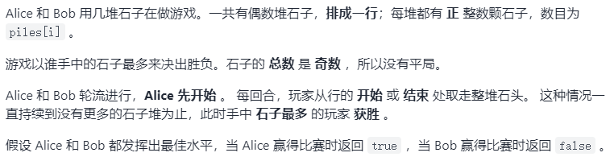
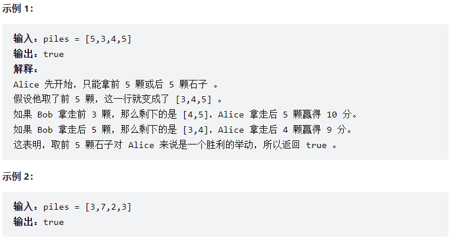
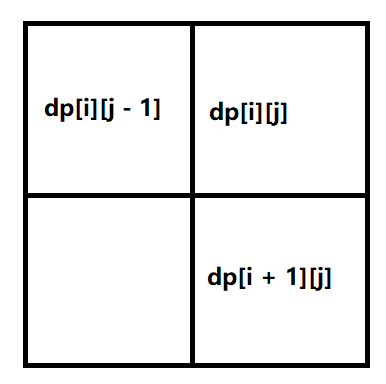
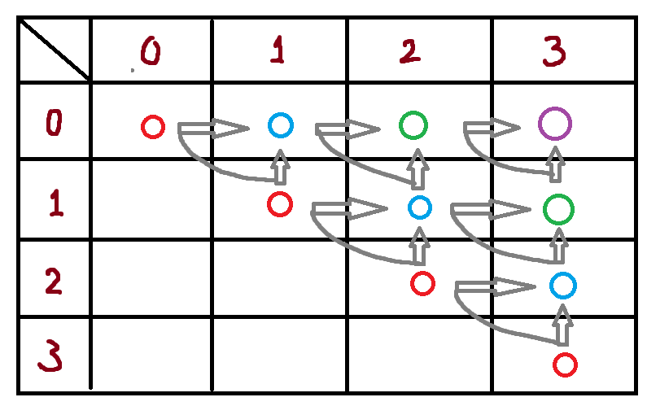
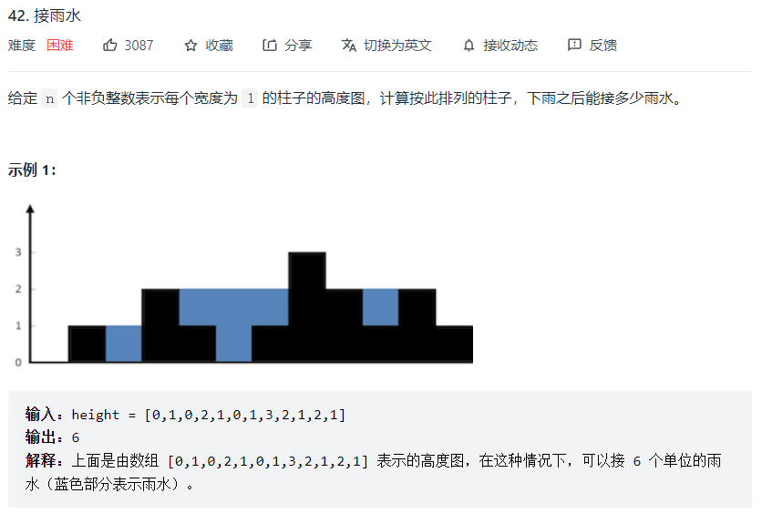
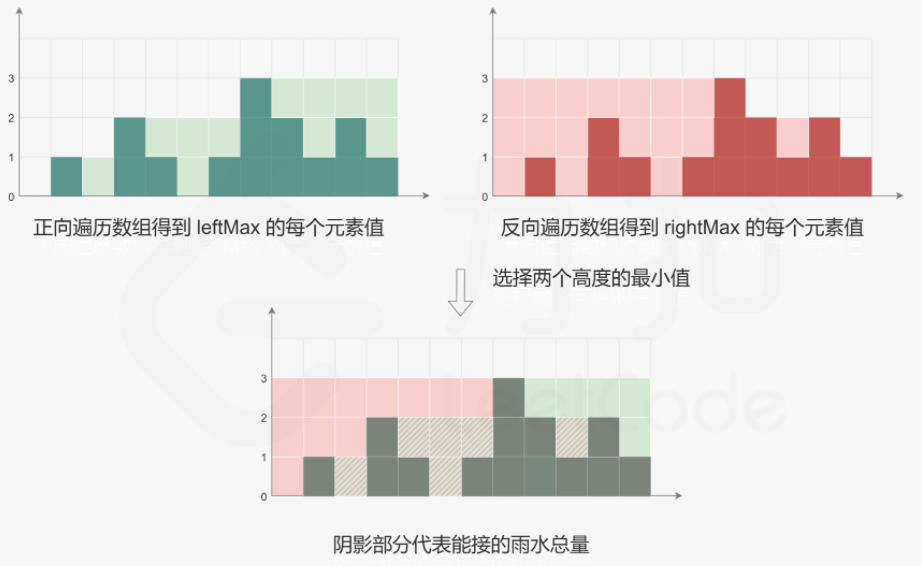

这类题一般是告诉一组数据，然后求出可能性或最值。

#### 动态规划

利用历史记录，避免重复计算，以空间换时间。

**动态规划的步骤：**

1. 定义数组元素的含义，当开辟额外空间（如数组）保存历史记录时，需要定义数组元素代表的含义
2. 找出数组元素之间的关系式，类似于递推公式，即如何用 $dp[n-1], dp[n-2], ...,dp[1]$ 来推出 $dp[n]$
3. 找出初始值，即如何对数组进行初始化

**例题1：青蛙跳台阶**

一只青蛙一次可以跳上一级或两级台阶，求该青蛙跳上 n 级台阶有多少种跳法。

1. 定义数组元素的含义

   定义 dp[i] 为：跳上一个 i 级台阶共有 dp[i] 种跳法

2. 找出数组元素之间的关系式

   若要跳到第 i 级，可以从第 i-1 级跳上来，也可以从第 i-2 级跳上来，因此:

   dp[n] = dp[n-1] + dp[n-2]

3. 找出初始值

   当 n=1 时，dp[1] = 1；当 n=0 时，dp[0] = 0

```js
var steps = function (n) {
    if (n <= 1) return n;
    let dp = new Array(n + 1);
    dp[0] = 0;
    dp[1] = 1;
    dp[2] = 2;  // 坑
    for (let i = 3; i <= n; i++) {
        dp[i] = dp[i - 1] + dp[i - 2];
    }
    return dp[n];
}
```

**例题2：二维网格路径可能性**

一个 m*n 矩阵，机器人位于左上角，终点在右下角，有多少种可能的路径？

1. 定义元素含义

   dp\[i][j]：当机器人从起点走到 dp[i]\[j] 这个位置时，一共有多少种路径

2. 找出关系式

   由于机器人只能向下走或向右走，有两种方式到达 (i, j) 处：

   一种是 (i-1, j) 走一步到达，另一种是 (i, j-1) 走一步到达

   因此 `dp[i][j] = dp[i-1][j] + dp[i][j-1]`

3. 找出初始值

   `dp[0][0..n-1] = 1`

   `dp[0..m-1][0] = 1`

```js
var uniquePaths = function (m, n) {
    if (m <= 0 || n <= 0)  return 0;
    let dp = [];
    for (let i = 0; i < m; i++) {
        dp.push(new Array[n]);
    }
    
    for (let i = 0; i < m; i++) {
        dp[i][0] = 1;
    }
    for (let i = 0; i < n; i++) {
        dp[0][i] = 1;
    }
    
    for (let i = 1; i < m; i++) {
        for (let j = 1; j < n; j++) {
            dp[i][j] = dp[i-1][j] + dp[i][j-1];
        }
    }
    
    return dp[m-1][n-1];
}
```

**例题3：路径数字总和最小**

给定一个 m*n 的网格，找到一条从左上角到右下角的路径，使得路径上数字总和最小。

1. 定义元素含义

   `dp[i][j]`：从左上角走到(i,j)时的**最小**路径和

2. 找关系式

   `dp[i][j] = Math.min(dp[i-1][j], dp[i][j-1]) + arr[i][j]`

   其中 arr[i][j\] 为网格中的值

3. 找初始值

   `dp[0][0] = arr[0][0]`

   `dp[0][j] = arr[0][j] + dp[0][j-1]  j >= 1`

   `dp[i][0] = arr[i][0] + dp[i-1][0]  i >= 1`

```js
var uniquePaths = function (arr) {
    let m = arr.length,
        n = arr[0].length;
    if (m <= 0 || n <= 0)  return 0;
    
    let dp = [];
    for (let i = 0; i < m; i++) {
        dp.push(new Array(n));
    }
    
    dp[0][0] = arr[0][0];
    for (let i = 1; i < m; i++) {
        dp[i][0] = arr[i][0] + dp[i-1][0];
    }
    for (let j = 1; j < n; j++) {
        dp[0][j] = arr[0][j] + dp[0][j-1];
    }
    
    for (let i = 1; i < m; i++) {
        for (let j = 1; j < n; j++) {
            dp[i][j] = Math.min(dp[i-1][j], dp[i][j-1]) + arr[i][j];
        }
    }
    return dp[m-1][n-1];
}
```

**例题4：编辑距离**

给定两个单词 word1 word2，计算出将 word1 转换为 word2 所使用的最少操作数。

可以对一个单词进行：插入一个字符、替换一个字符或删除一个字符。

1. 定义数组元素的含义

   `dp[i][j]`：当字符串 word1 长度为 i，word2 长度为 j 时，将 word1 转化为 word2 所使用的的最少操作次数

2. 找出关系式

   - 若 word1[i] 与 word2[j] 相等，不需要进行任何操作，显然有 `dp[i][j] = dp[i-1][j-1]`
   - 若 word1[i] 与 word2[j] 不相等，这时需要进行调整：
     - 若把字符 word1[i] 替换成与 word2[j] 相等，则有 `dp[i][j] = dp[i-1][j-1] + 1`
     - 若在 word1 末尾插入一个与 word2[j] 相等的字符，则有 `dp[i][j] = dp[i][j-1] + 1`
     - 若把字符 word1[i] 删除，则有 `dp[i][j] = dp[i-1][j] + 1`
     - 综上，此时 `dp[i][j] = Math.min( dp[i-1][j-1], dp[i][j-1], dp[i-1][j]) + 1`

3. 找出初始值

   dp[0]\[0] = 0;

   当 dp[i]\[j] 中，如果 i 或 j 有一个为 0，那么转化时就只能一直进行插入或删除操作。

```js
var minDistance = function (word1, word2) {
    let n1 = word1.length, n2 = word2.length;
    let dp = [];
    for (let i = 0; i <= n1; i++) {
        dp.push(new Array(n2 + 1));
    }
    
    dp[0][0] = 0;
    for (let j = 1; j < n2; j++) {
        dp[0][j] = dp[0][j-1] + 1;
    }
    for (let i = 1; i < n1; i++) {
        dp[i][0] = dp[i-1][0] + 1;
    }
    
    for (let i = 1; i <= n1; i++) {
        for (let j = 1; j <= n2; j++) {
            dp[i][j] = Math.min( dp[i-1][j-1], dp[i][j-1], dp[i-1][j] ) + 1;
        }
    }
    
    return dp[n1][n2];
}
```


#### 动态规划的空间优化

**例题：**





1. 定义 `f[l][r]` 为考虑区间 [l, r]，在双方都做好选择的情况下，先手与后手最大得分差值为多少。那么 `f[0][n - 1]` 为考虑所有石子，先手与后手的得分差值：

   - `f[0][n - 1] > 0` 则先手必胜，返回 true
   - `f[0][n - 1] < 0` 则先手必败，返回 false

2. 不失一般性地考虑 `f[l][r]` 如何转移，根据题意只能从两端取石子，两种情况：

   - 从左端取石子，价值为 piles[l]，取完石子后，原来的后手变为先手，从 [l+1, r] 区间做最优决策，所得价值为 f[l+1]\[r]，因此本次先手从左端点取石子的话，双方差值为：piles[l] - f[l + 1]\[r]
   - 从右端取石子，价值为 piles[r]，取完石子后，原来的后手变为先手，从 [l, r-1]区间做最优决策，所得价值为 f[l]\[r-1]，因此本次先手从右端点取石子的话，双方差值为：piles[r] - f[l]\[r - 1]

   双方都想赢，都会做最优决策，因此 f\[l][r] 为上述两种情况中的最大值。

   `f[l][r] = Math.max(piles[l] - f[l+1][r], piles[r] - f[l][r-1])`

3. 初始值 `f[i][i] = piles[i]  1 <= i <= n - 1`

```js
var stoneGame = function (piles) {
    const length = piles.length;
    const dp = new Array(length).fill(0).map(() => new Array(length).fill(0));
    for (let i = 0; i < length; i++) {
        dp[i][i] = piles[i];
    }
    
    // i 从 0 到 n - 2，j 从 i + 1 到 n - 1，能够方便 i < j
    for (let i = length - 2; i >= 0; i++) {
        for (let j = i + 1; j < length; j++) {
            dp[i][j] = Math.max(piles[i] - dp[i+1][j], piles[j] - dp[i][j-1]);
        }
    }
    
    return dp[0][n - 1] > 0;
}
```

**空间优化：**

分析状态转移方程可知，dp[i]\[j] 的值只和 dp\[i+1][j] 和 dp[i]\[j-1] 有关，也就是说，在计算 dp 的第 i 行的值时，只需要用到 dp 的第 i 行和第 i+1 行的值，因此可以用一维数组代替二维数组，进行空间优化。

```js
var stoneGame = function(piles) {
    const length = piles.length;
    const dp = new Array(length).fill(0);
    for (let i = 0; i < length; i++) {
        dp[i] = piles[i];
    }
    
    for (let i = length - 2; i >= 0; i++) {
        for (let j = i + 1; j < length; j++) {
            dp[j] = Math.max(piles[i] - dp[j], piles[j] - dp[j - 1]);
        }
    }
    
    return dp[length - 1] > 0;
}
```

`dp[i+1][j] 和 dp[i][j-1]`位于同一个左下对角线上，而`dp[i][j]`就在二者的右上角一格，即



假设共有四堆石子，如图：



那么该二维矩阵只有对角线上方区域是用到的，且 `dp[0][3]` 是我们最终要求的答案，而求得 `dp[0][3]` 的过程如下：

- 要想求 `dp[0][3]`，首先需要求出 `dp[0][2] 和 dp[1][3]`
- 要想求 `dp[0][2]`，首先需要求出 `dp[0][1] 和 dp[1][2]`；要想求 `dp[1][3]`，首先需要求出 `dp[1][2] 和 dp[2][3]`
- 而 `dp[i][i] = piles[i]`
- 以此类推，因此，最多只需要开辟大小为 4 的一维数组即可存储所有有用状态，该一维数组每个元素 `dp[i] = piles[i]`，即原二维数组的初始值 `dp[i][i]`


#### 其他例题

#### 1、给定几种面额的硬币和一个总额，用最少的硬币凑成这个总额

```js
var coinChange = function (coins, amount) {
    let max = amount + 1;
    let dp = new Array(amount + 1);
    dp.fill(max);
    dp[0] = 0;
    
    for (let i = 1; i < max; i++) {
        for (let j = 0; j < coins.length; j++) {
            if (coins[j] <= i) {
                dp[i] = Math.min(dp[i], dp[i - coins[j]] + 1);
            }
        }
    }
    
    return dp[amount] > amount ? -1 : dp[amount];
};
```

使用了动态规划，将从 0 到目标额度所需的最小硬币数都列出来。

#### 2、求出从矩阵左上角走到右下角，且只能向右、向下移动，一共有多少走法

```js
var uniquePaths = function (m, n) {
    const pos = new Array(m);
    for (let i = 0; i < m; i++) {
        pos[i] = new Array[n];
    }
    for (let i = 0; i < n; i++) {
        pos[0][i] = 1;
    }
    for (let i = 0; i < m; i++) {
        pos[i][0] = 1;
    }
    for (let i = 1; i < m; i++) {
        for (let j = 1; j < n; j++) {
            pos[i][j] = pos[i-1][j] + pos[i][j-1];
        }
    }
    return pos[m-1][n-1]
};
```

使用动态规划逐步列出每一格的可能性，最后返回最右下角的可能性。

#### 3、获取给定数组连续元素累加最大值

```js
var maxSubArray = function (nums) {
    let count = nums[0], maxCount = nums[0];
    for (let i = 1; i < nums.length; i++) {
        count = Math.max(count + nums[i], nums[i]);
        maxCount = Math.max(maxCount, count);
    }
    return maxCount;
};
```

通过不断对比最大值并保存最大值。

#### 4、接雨水





维护两个数组left_max和right_max，用于记录每个位置的左侧柱子最高高度和右侧柱子最高高度，则当前位置可以接的雨水量为：

$左右侧柱子最高高度的较小值\ -\ 当前位置的柱子高度$

```js
/**
 * @param {number[]} height
 * @return {number}
 */
var trap = function(height) {
    let left_max = new Array(height.length), right_max = new Array(height.length);
    let ans = 0;
    // 动态规划数组初始值为最左侧和最右侧柱子的高度
    left_max[0] = height[0];
    right_max[height.length - 1] = height[height.length - 1];

    // 初始化左侧柱子最高值数组
    for (let i = 1; i < height.length; i++) {
        left_max[i] = Math.max(height[i], left_max[i - 1]);
    }
	// 初始化右侧柱子最高值数组
    for (let i = height.length - 2; i >= 0; i--) {
        right_max[i] = Math.max(height[i], right_max[i + 1]);
    }
	// 位置i可以接到的雨水量为左右侧最高高度的较小值减去当前柱子高度
    for (let i = 0; i < height.length; i++) {
        ans += Math.min(left_max[i], right_max[i]) - height[i];
    }

    return ans;
};
```

