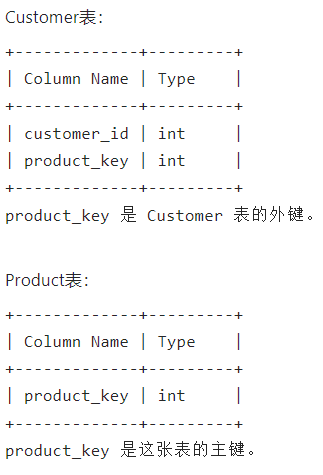
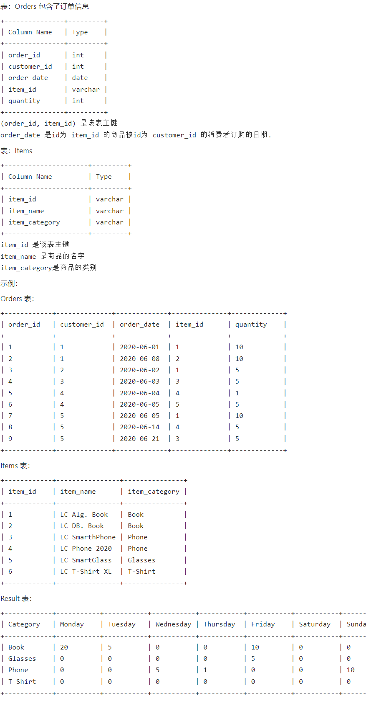
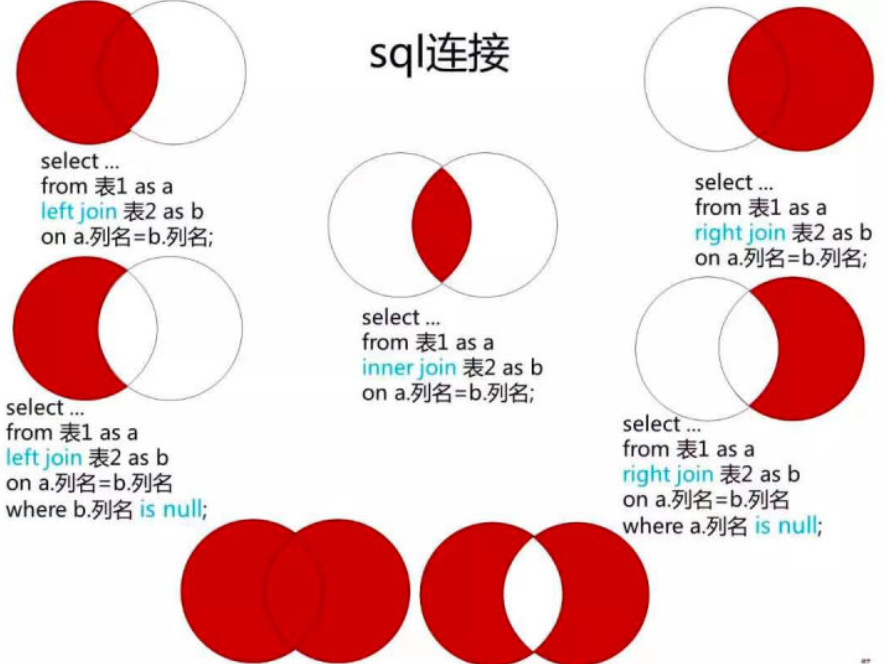
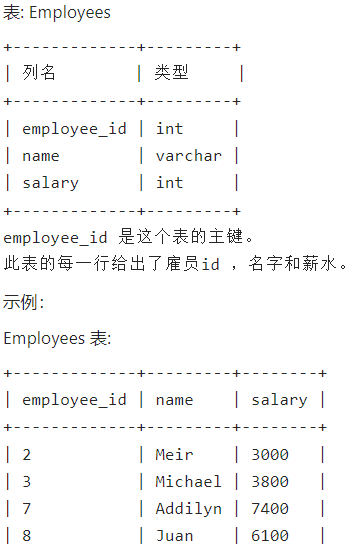
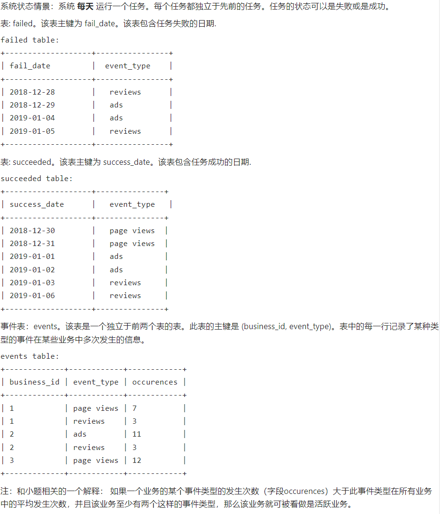
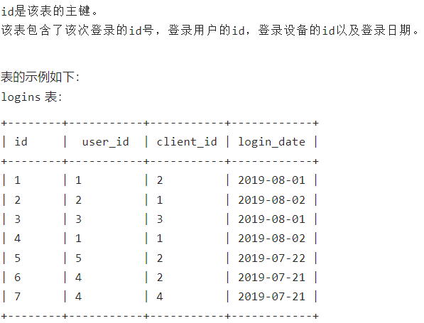

#### 1、查询购买了所有产品的客户



**思路：**

- 首先需要根据客户进行分组，因此需要 group by 客户id
- 然后从 Product 表中 count(distinct product_key)，就是选出所有产品
- 如果在按客户id分组的表中找到了 count(distinct product_key) 和第二步查找结果相同的，就意味着找到了购买了所有产品的客户

```mysql
select customer_id
from Customer
group by customer_id
having count(distinct product_key) = any  # = any 和 in 是等效的，而 any 和 some 又是等效的
(select count(distinct product_key) from Product);
```


#### 2、统计每类商品在周一到周日（可以跨周）的总销量



查询周内每天每个商品类别下订购了多少单位，结果返回：Category, Monday, Tuesday, Wednesday, Thursday, Friday, Saturday, Sunday，按商品类别升序

**思路：**

1、两表连接



- table1 xx join table2 on table1.colname = table2.colname
  - 等价于 using(colname)
- table1 left join table2：要查询的完整信息位于表1中，如表1是学生信息表，表2是选课信息表，而不一定所有学生都选课了，因此若要求查询所有学生的选课信息时，应当左连接

2、题目解析

- 对于这道题来说，要查询每类商品订购了多少个，因此要求所有类别的商品都要统计，而可能有的商品没被订购，因此需要：Items left join Orders
- ifnull 用法：ifnull(expression1, expression2)，如果表达式1为空则使用表达式2，否则使用表达式1
- if 用法：if(expression, res1, res2)，如果表达式为真，使用res1，否则使用res2
- order by 子句要放在 where 和 group by 子句的后边
  - ASC: 默认升序
  - DESC：降序
- dayname(date)：获取某一日期是星期几的英文名
- weekday(date)：获取某一日期是星期几的索引，星期一是0

```sql
select item_category Category,
ifnull(sum(if(dayname(order_date)='Monday', quantity, 0)), 0) Monday,
ifnull(sum(if(dayname(order_date)='Tuesday', quantity, 0)), 0) Tuesday,
ifnull(sum(if(dayname(order_date)='Wednesday', quantity, 0)), 0) Wednesday,
ifnull(sum(if(dayname(order_date)='Thursday', quantity, 0)), 0) Thursday,
ifnull(sum(if(dayname(order_date)='Friday', quantity, 0)), 0) Friday,
ifnull(sum(if(dayname(order_date)='Saturday', quantity, 0)), 0) Saturday,
ifnull(sum(if(dayname(order_date)='Sunday', quantity, 0)), 0) Sunday
from Items i left join Orders o
on i.item_id=o.item_id
group by item_category
order by item_category;
```


#### 3、特殊的奖金



查询每个雇员的奖金。如果一个雇员的id是奇数并且他的名字不是以'M'开头，那么他的奖金是他工资的100%，否则奖金为0。返回雇员编号employee_id和奖金bonus，结果按照employee_id升序。

**思路：**

- 直接筛选即可
- left(str, length)：从 str 的左侧开始选取 length 个字符并返回

```sql
select employee_id,
if (employee_id%2=1 and left(name, 1)!='M', salary, 0) bonus
from Employees
order by employee_id;
```


#### 4、任务的状态



##### 4.1 分别求出每个event事件的成功天数和失败天数，结果字段包含：event_type, success_count, fail_count

**思路**：

- 分别在 succeeded 表和 failed 表中查询每个类型任务的成功/失败次数，并将查询结果的两个表分别命名为 success、fail
- 然后将 fail right join success using(event_type)，或 success left join fail using(event_type)，即把两表查询结果按列连接在一起，只保留 event_type 相同的行
- 然后从两表连接结果中选取 event_type、成功次数、失败次数构成新表即可
- 注：两表连接的时候，可能出现某个任务没有失败或成功的情况，此时为null，应该用0代替，因此使用了 ifnull 语句

```sql
select success.event_type as event_type,
       ifnull(success.succs, 0) as success_count,
       ifnull(fail.fails, 0) as fail_count
from

(select event_type, count(*) as fails from failed
group by event_type) fail
  
right join 

(select event_type, count(*) as succs from succeeded
group by event_type) success

using(event_type);
```


##### 4.2 查询所有活跃的业务，结果字段只包含 business_id

活跃业务：如果一个业务的某个事件类型的发生次数（字段occurences）大于此事件类型在所有业务中的平均发生次数，并且该业务至少有两个这样的事件类型，那么该业务就可被看做是活跃业务。

**思路：**

- ev 表：统计每个事件类型的平均发生次数
- e 表：即 events 表
- e left join ev using(event_type)，将两表进行左连接，然后按 business_id 统计其对应的每个类型的 event 发生次数，如果大于该类型事件的平均发生次数 ev.o，则记为 1，否则记为 0，如果该 business_id 对应的满足条件的事件大于两个，说明是活跃业务

```sql
select business_id from

events e
left join
(select event_type, avg(occurences) as o from events
group by event_type) ev
on ev.event_type=e.event_type

group by business_id
having sum(if(e.occurences > ev.o), 1, 0) >= 2;
```


##### 4.3 查询事件类型发生次数最多的 business_id

**思路**：

- 按 business_id 进行分组，然后计算其下事件发生的总次数，然后按降序排列，取第一位即可
- limit子句：LIMIT row_count OFFSET offset，从 row_count 开始，偏移 offset 位的元组值

```sql
select t.business_id from
(select business_id, sum(occurences) as cnt from events
group by business_id) t
order by t.cnt
limit 1,1
```


#### 5、登录状态的留存



##### 5.1 查询新用户的留存率，即新用户第1天登陆之后，第2天再次登陆的概率，结果返回留存率rate

- 找出新用户们首次登录的日期，记录为表 new_users
- new_users left join logins，连接条件：user_id 相等，并且在 logins 表中存在 new_users 中某一新用户 first_date + 1day，也即，该新用户第二天又登陆了系统
- date_add(some_date, INTERVAL XX DAY)：在 some_date 基础上加上 XX 天
- 最后，用有新用户第二天登录的天数 count(L.login_date) 除以新用户总数 count(new_users.first_date) 或 count(new_users.user_id) 即得 rate

```sql
select count(L.login_date)/count(new_users.first_date) rate from

(select user_id, min(login_date) first_date from logins
group by user_id) new_users

left join

logins L

on new_users.user_id = L.user_id and
L.login_date = date_add(new_users.first_date, interval 1 day);
```


##### 5.2 查询登录新用户个数不少于2个的日期，结果返回日期login_date和登录新用户个数new_user_num，以login_date升序排序

- 先筛选出所有的新用户及他们的第一次登陆日期：new_users
- 然后将 new_users 表按照 first_date 分组，只保留那些含有两个或以上新用户的 first_date
- 然后将分组过滤后的 new_users 表按照登录日期升序排序即可

```sql
select first_date as login_date, count(*) as new_user_num from

(select user_id, min(login_date) as first_date from logins
group by user_id) new_users

group by first_date
having count(*) >= 2
order by first_date;
```

