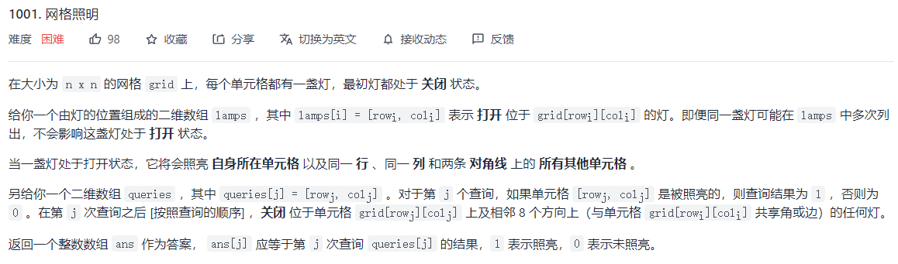
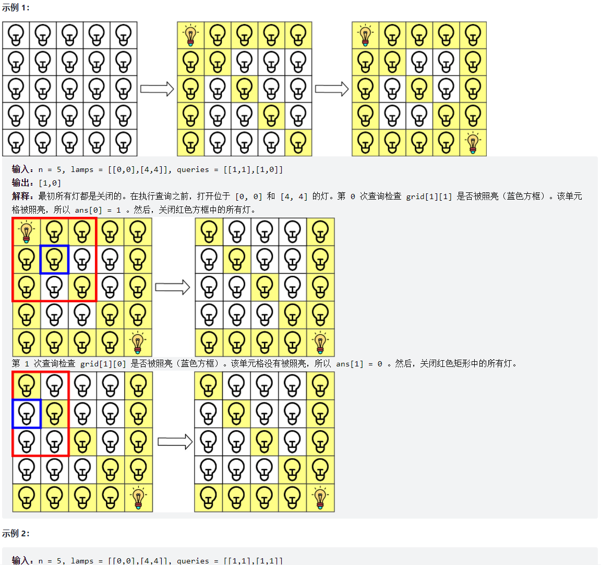
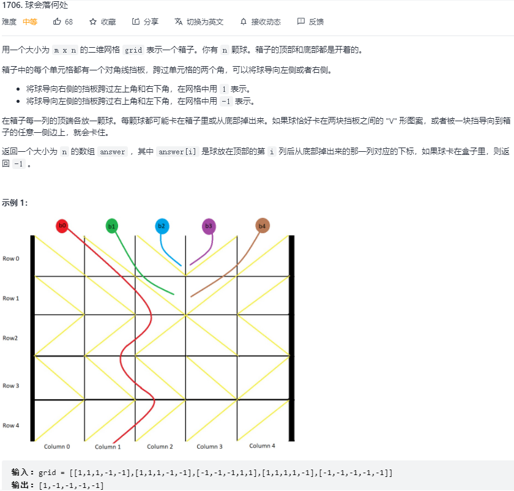

#### 1、照明网格

**哈希表+模拟**





```js
var gridIllumination = function(n, lamps, queries) {
    // xi => 行，用xi唯一标识被照亮的行
    // yi => 列，用yi唯一标识被照亮的列
    // xi - yi => 正对角线，用xi-yi唯一标识被照亮的正对角线
    // xi + yi => 反对角线，用xi+yi唯一标识被照亮的反对角线
    
    // 用哈希表标记当前行/列/正反对角线上的灯的数目
    let rows = new Map(),
        cols = new Map(),
        dj1 = new Map(),
        dj2 = new Map();
    // 集合用来存放有灯的点
    let points = new Set();

    for (let lamp of lamps) {
        const x = lamp[0], y = lamp[1];
        if (points.has(point2Str(x, y))) {
            // 若出现重复的灯，不予处理
            continue;
        }
		// 加入灯的坐标，并在行、列、正反对角线对应的映射灯数加一
        points.add(point2Str(x, y));
        rows.set(x, (rows.get(x) || 0) + 1);
        cols.set(y, (cols.get(y) || 0) + 1);
        dj1.set(x - y, (dj1.get(x - y) || 0) + 1);
        dj2.set(x + y, (dj2.get(x + y) || 0) + 1);
    }

    let ans = new Array(queries.length).fill(0);
    // 用于某次查询后，对九宫格内的灯进行熄灭操作
    const dirs = [ [0,0], [1,0], [-1,0], [0,1], [0,-1], [1,1], [-1,1], [1,-1], [-1,-1] ];
    for (let [i, [x, y]] of queries.entries()) {
        if (rows.get(x) || cols.get(y) || dj1.get(x - y) || dj2.get(x + y)) {
            // 若当前点已被照亮，设置为1
            ans[i] = 1;
        }
        for (let dir of dirs) {
            // 九个方向（包括自身点）进行灭灯
            const nx = x + dir[0], ny = y + dir[1];
            if (nx >= 0 && nx < n && ny >= 0 && ny < n) {
                if (points.has(point2Str(nx, ny))) {
                    points.delete(point2Str(nx, ny));
                    rows.set(nx, rows.get(nx) - 1);
                    cols.set(ny, cols.get(ny) - 1);
                    dj1.set(nx - ny, dj1.get(nx - ny) - 1);
                    dj2.set(nx + ny, dj2.get(nx + ny) - 1);
                }
            }
        }
    }

    return ans;
};

function point2Str(x, y) {
    return x + ',' + y;
}
```


#### 2、球落在何处



**模拟思路：**

- 对于某列 col 上的小球，其当前位置为 `(i,j)`，若 `grid[i][j] === 1`，则为正对角线，此时 `j++`，若 `grid[i][j] === -1`，则为反对角线，此时 `j--`，若 `j` 越过了左右边界，则说明卡住了；若 `grid[i][j] !== grid[i][j + 1]`，说明左右两格形成了 V 字，也卡住了

```js
/**
 * @param {number[][]} grid
 * @return {number[]}
 */
var findBall = function(grid) {
  const m = grid.length, n = grid[0].length;
  let ans = new Array(n);

  const getVal = function(col) {
    // 从第一行开始往下掉
    let row = 0;
    while (row < m) {
      // 计算出小球下降一行后所处的列位置
      let ne = col + grid[row][col];
      // 越过了左右板子
      if (ne < 0 || ne >= n) return -1;
      // 左右形成V字
      if (grid[row][ne] !== grid[row][col]) return -1;

      col = ne;
      row++;
    }
    return col;
  };

  for (let col = 0; col < n; col++) {
    ans[col] = getVal(col);
  }

  return ans;
};
```

