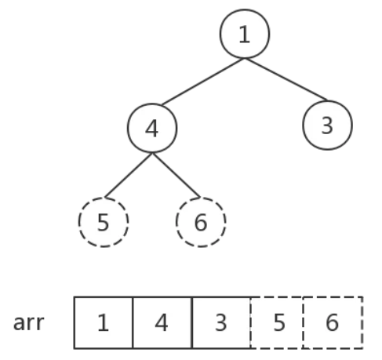
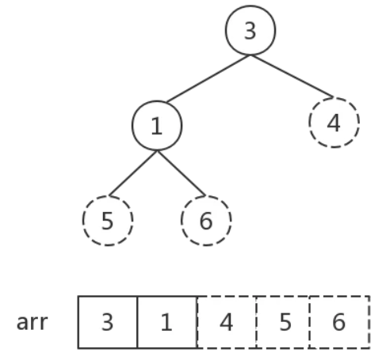
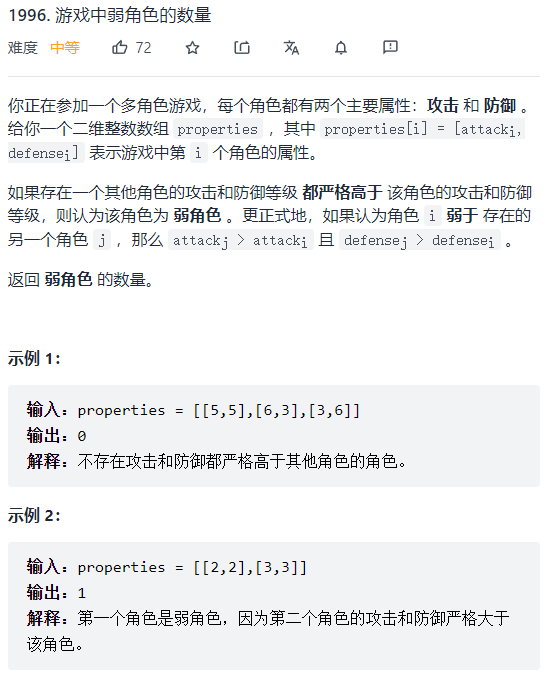

<a href="https://blog.csdn.net/Mayness/article/details/98884165">参考链接</a>


**稳定性**是指相同数据的相对位置是否改变，即在原数组中，若 $r_i=r_j\ 且\ i<j$，则排序后若 $r_i$ 仍在 $r_j$ 前面，则称此排序是稳定的。

#### 1、冒泡排序

比较任何两个相邻的项，如果前一项比后一项大，则交换它们。

平均时间复杂度：$O(n^2)$，最好情况：$O(n)$，稳定排序（数据相同时不交换）。


```js
// 初始版
var bubbleSort = function (array) {
    let ans = [...array];
    let length = array.length;
    for (let i = 0; i < length; i++) {
        for (let j = 0; j < length - 1; j++) {
            if (ans[j] > ans[j + 1]) {
                swap(j, j+1);
            }
        }
    }
    return ans;
};

// 改进版：省去不必要的比较
var bubbleSort = function (array) {
    let ans = [...array];
    let length = array.length;
    for (let i = 0; i < length; i++) {
        for (let j = 0; j < length - (i + 1); j++) {
            if (ans[j] > ans[j + 1]) {
                swap(j, j+1);
            }
        }
    }
}
```

#### 2、选择排序

找到数组中的最小值并将其放置在第一位，接着找到第二小的值并将其放在第二位，以此类推。

时间复杂度：$O(n^2)$，不稳定排序（如 arr = [5,8,5,2,9]，在第一次选择时，arr[0]和arr[3]会进行交换，此时两个相等的 5 的相对顺序发生了改变）


```js
var selectionSort = function (array) {
    let ans = [...array];
    let length = array.length, indexMin;
    for (let i = 0; i < length - 1; i++) {
        indexMin = i;
        for (let j = i; j < length; j++) {
            if (ans[indexMin] > array[j]) {
                indexMin = j;
            }
        }
        if (i !== indexMin) {
            swap(i, indexMin);
        }
    }
    return ans;
}
```

#### 3、插入排序

每次排一个数组项，以此方式构建最后的排序数组。假定第一项已经排序了，接着将其与第二项进行比较，并决定第二项应该待在原位还是插到第一项之前；头两项正确排序后，接着比较第三项，并决定第三项应该插入到第一、第二还是原位，以此类推。

平均时间复杂度：$O(n^2)$，最好情况：$O(n)$，稳定排序（不会交换相等项）


```js
var insertionSort = function (array) {
    let length = array.length, j, temp;
    let ans = [...array];
    for (let i = 1; i < length; i++) {
        j = i;
        // 现在要考虑第i项——a[i]要插入到何处，先用temp暂存该项
        temp = ans[i];
        
        // 若前一项大于该项，则将前一项往后挪，直到找到插入位置
        while (j > 0 && ans[j - 1] > temp) {
            // 将前一项挪到后一项
            ans[j] = ans[j - 1];
            j--;
        }
        
        // 插入
        ans[j] = temp;
    }
    return ans;
};
```

#### 4、希尔排序

插入排序的更高效率的实现，会优先比较距离较远的元素，希尔排序的核心在于间隔序列的设定，既可以提前设定好间隔序列，也可以动态定义间隔序列。

平均时间复杂度：$O(nlogn)$，不稳定排序。

```js
var shellSort = function (array) {
    let len = array.length, temp, gap = 1;
    while (gap < len / 3) {
        gap = gap * 3 + 1;
    }
    for (; gap > 0; gap = Math.floor(gap / 3)) {
        for (let i = gap; i < len; i++) {
            temp = arr[i];
            for (let j = i - gap; j >= 0 && array[j] > temp; j -= gap) {
                array[j + gap] = array[j];
            }
            array[j + gap] = temp;
        }
    }
    return array;
}
```

#### 5、归并排序

分治思想的典型应用，可以采用自上而下的递归和底下而上的迭代两种方式。在JS中，递归层次太深，而JS语言之前没有提供尾递归优化，可能造成栈溢出，因此采用迭代。

但是在ES6中已经添加了对尾递归优化的支持，但需要在严格模式下才能开启，尾递归优化发生时，函数调用栈会改写，在正常模式下用于跟踪函数调用栈的两个变量：`func.arguments`和`func.caller`在改写时会失真，而严格模式会禁用这两个变量。因此尾调用模式仅在严格模式下生效。

时间复杂度：$O(nlogn)$，空间复杂度：$O(n)$，空间换时间，稳定排序。


```js
var mergeSort = function (arr) {
    let len = arr.length;
    if (len < 2) return arr;
    let middle = Math.floor(len / 2),
        left = arr.slice(0, middle),
        right = arr.slice(middle);
    return merge(mergeSort(left), mergeSort(right));
};

function merge(left, right) {
    let res = [];
    while (left.length && right.length) {
        // 将左部分数组和右部分数组的首部元素进行大小比较，并将较小者弹出并放入结果数组中
        if (left[0] <= right[0]) {
            // 不会改变相等数据的相对次序
            res.push(left.shift());
        } else {
            res.push(right.shift());
        }
    }
    while (left.length) {
        res.push(left.shift());
    }
    while (right.length) {
        res.push(right.shift());
    }
    return res;
}
```

#### 6、快速排序

分治思想的典型应用，是在冒泡排序基础上的递归分治法。其内循环比大多数排序算法都要短小，主要缺点是很脆弱，实现有误差就会变成慢排序。

平均时间复杂度：$O(nlogn)$，通常情况下快于归并排序，最坏情况：$O(n^2)$

空间复杂度：$O(logn)$


- 主要流程
  1. 在数据集中选择一个元素作为基准(pivot)
  2. 对于所有小于基准的元素，都移到基准的左边；所有大于基准的元素，都移到基准的右边
  3. 当左指针大于右指针时，对基准左边和右边的两个子集，不断重复第一步和第二步，直到所有子集只剩下一个元素

- 示例（以选取第一个元素为基准值为例）
  - `var items = [6, 1, 2, 7, 9, 3, 4, 5, 10, 8]`
  - 若选择第一个元素`6`为基准值，左指针索引值为`0`，右指针索引值为`items.length-1`
  - 由于选取了第一个元素为基准值，因此先移动右指针，移动到`5`的时候，发现`5<6`，右指针停止，左指针移动；左指针移动到`7`时，发现`7>6`，左指针停止移动
  - 交换两指针所指向的值，得`[6,1,2,5,9,3,4,7,10,8]`
  - 然后，右指针接着向左移动（选择第一个元素当基准值，那么每次都要让右指针开始移动），发现`4<6`，右指针停止；左指针移动，发现`9>6`，也停止
  - 交换两指针所指向的值，得`[6,1,2,5,4,3,9,7,10,8]`
  - 然后，右指针接着向左移动，发现`3<6`，右指针停止；左指针继续向右移动，此时左指针也指向`3`，两指针相遇，说明第一次探测结束，将基准值`6`和最终值`3`进行交换，得`[3,1,2,5,4,6,9,7,10,8]`，此时以`6`为分界点，左子集的值都小于它，右子集的值都大于它，然后以`6`为分界点拆分为两个序列`[3, 1, 2, 5, 4]`和`[9, 7, 10, 8]`
  - 对于左子集序列`[3, 1, 2, 5, 4]`重复以上步骤：
    - 选基准值`3`，移动右指针到`2`处，此时`2<3`，右指针停止
    - 移动左指针到`2`处，此时左右指针相遇，将所指的值与基准值`3`进行交换得序列`[2, 1, 3, 5, 4]`，然后以`3`为分界点拆分为两个序列`[2, 1]` 和`[5, 4]`
    - 对于`[2, 1]`，交换后得`[1, 2]`
    - 对于`[5, 4]`，交换后得`[4, 5]`
    - 于是最终结果为`[1, 2, 3, 4, 5]`
  - 对于右子集序列`[9, 7, 10, 8]`重复以上步骤：
    - 选基准值`9`，移动右指针到`8`处，此时`8<9`，右指针停止
    - 移动左指针到`10`处，此时`10>9`，左指针停止
    - 交换左右指针指向的值，得`[9, 7, 8, 10]`
    - 移动右指针到`8`处，此时左右指针相遇，交换基准值得`[8, 7, 9, 10]`
    - 对于左子集序列`[8, 7]`，交换后得`[7, 8]`
    - 于是最终结果为`[7, 8, 9, 10]`
  - 于是最终结果为`[1, 2, 3, 4, 5, 6, 7, 8, 9, 10]`

```js
// 版本1：较为复杂，但内存占用小
var quickSort = function (arr, l, r) {
	let len = arr.length,
        index,  // 记录基准值的位置
        left = typeof l !== 'number' ? 0 : l,
        right = typeof r !== 'number' ? len - 1 : r;
    
    if (left < right) {
        // 获取基准值索引，以便左右分治
        index = partition(arr, left, right);
        // 基准值左侧子序列
        quickSort(arr, left, index - 1);
        // 基准值右侧子序列
        quickSort(arr, index + 1, right);
    }
    
    return arr;
};

function partition(arr, left, right) {
    // 选取第一个元素做基准值
    // index索引指向arr中待交换位置
    let pivot = left, index = pivot + 1;
    for (let i = index; i <= right; i++) {
        if (arr[i] < arr[pivot]) {
            swap(arr, i, index);
            index++;
        }
    }
    // 交换基准值和index-1位置，交换后index-1位置指向pivot
    swap(arr, pivot, index - 1);
    return index - 1;
}

function swap(arr, i, j) {
    let tmp = arr[i];
    arr[i] = arr[j];
    arr[j] = tmp;
}


// 版本2：阮一峰
// 通过遍历找到比基准值大和小的值，并存入left和right数组中，然后递归
// 易于理解，内存占用大
var quickSort = function(arr) {
    if (arr.length <= 1) return arr;
    let pivotIndex = Math.floor(arr.length / 2);  // 选择中间值为基准
    
    // 此处不能只用pivot = arr[pivotIndex]取出pivot，而是要将其分割出来，否则无限递归
    let pivot = arr.splice(pivotIndex, 1)[0];  // 从arr中去除pivot值
    let left = [], right = [];
    
    for (let i = 0; i < arr.length; i++) {
        if (arr[i] < pivot) left.push(arr[i]);
        else right.push(arr[i]);
    }
    
    return quickSort(left).concat([pivot], quickSort(right));
}
```

#### 7、堆排序

堆是一个完全二叉树，完全二叉树是指二叉树除开最后一层，其它层节点数都达到最大，且最后一层所有节点集中在左边。堆可以由数组实现，相当于对二叉树做层序遍历。

**对于节点$i$，其子节点为$2i+1$和$2i+2$**


- 大顶堆：每个节点的值都大于等于其子节点的值，用于升序排列
- 小顶堆：每个节点的值都小于等于其子节点的值，用于降序排列

**堆排序算法：**

1. 将初始二叉树转化为大顶堆(heapify)，实质上是从第一个非叶节点开始从下至上、从右至左，对每个非叶节点作`shiftDown`操作，此时根节点为最大值，将其与最后一个节点交换
2. 除开最后一个节点，将其余节点组成的新堆转化为大顶堆（实际上对根节点作`shiftDown`操作），此时根节点为最大值，然后将其与最后一个节点交换
3. 重复步骤2，直到对中元素个数为1，排序完成

**图解：**

对于初始堆

1. 初始化大顶堆，首先选取最后一个非叶结点（我们只需要调整父节点和子节点之间的大小关系，**子节点之间的大小关系无需调整**），则第一个非叶结点下标`i = Math.floor(arr.length / 2 - 1) = 1`，也就是数字`4`，找到三个数字的最大值，与父节点交换：

   

   然后，下标`i`依次减一，即从第一个非叶节点开始，从右至左，从下至上遍历所有非叶结点，后面没一次调整都是如此：找到父子节点中的最大值、做交换：

   

   这一步中数字`6`和`1`交换后，数字`[1, 5, 4]`组成的堆顺序不对，需要执行一步调整，需要注意：每一次对一个非叶结点作调整后，都要观察是否会影响子堆的顺序。因此将`[1, 5, 4]`子堆进行调整，最终的大顶堆见上图右侧。然后将根节点与最后一个节点交换：

   

2. 除开当前最后一个节点`6`（即最大值），将其余节点`[4, 5, 3, 1]`组成的新堆转化为大顶堆：

   

   将根节点与最后一个节点`1`进行交换：

   

3. 反复执行步骤2，直到对中元素个数为1：

   

   

   

   

```js
// 交换两个节点
function swap(A, i, j) {
  let temp = A[i];
  A[i] = A[j];
  A[j] = temp; 
}

/*
将 i 结点以下的堆整理为大顶堆，注意这一步实现的基础实际上是：假设 结点 i 以下的子堆已经是一个大顶堆，shiftDown函数实现的功能是实际上是：找到 结点 i 在包括结点 i 的堆中的正确位置。后面将写一个 for 循环，从第一个非叶子结点开始，对每一个非叶子结点都执行 shiftDown操作，所以就满足了结点 i 以下的子堆已经是一大顶堆
*/
function shiftDown(A, i, length) {
  let temp = A[i]; // 当前父节点
  // j<length 的目的是对结点 i 以下的结点全部做顺序调整
  for(let j = 2*i+1; j < length; j = 2*j+1) {
    temp = A[i];  // 将 A[i] 取出，整个过程相当于找到 A[i] 应处于的位置
    if (j + 1 < length && A[j] < A[j+1]) { 
      j++;   // 找到两个孩子中较大的一个，再与父节点比较
    }
    if(temp < A[j]) {
      swap(A, i, j) // 如果父节点小于子节点:交换；否则跳出
      i = j;  // 定位当前父节点换到的位置，以便后续swap
    } else {
      break;
    }
  }
}

// 堆排序
function heapSort(A) {
  // 初始化大顶堆，从第一个非叶子结点开始一直到根节点，都要进行调整
  // 第一个非叶结点取A[len/2 - 1]，可以考虑len = 2的极端情况，此时从根节点开始
  for(let i = Math.floor(A.length/2 - 1); i >= 0; i--) {
    // 从最后一个非叶结点开始，向上、向右，每个非叶结点都要下滤
    shiftDown(A, i, A.length);
  }
    
  // 排序，for的每次循环都将大顶堆的根节点和最后一个节点对换，然后下滤将堆重新调整为大顶堆
  for(let i = A.length - 1; i>0; i--) {
    swap(A, 0, i); // 根节点与最后一个节点交换
    shiftDown(A, 0, i); // 从根节点开始调整，并且最后一个结点已经为当前最大值，不需要再参与比较，所以第三个参数为 i，即比较到最后一个结点前一个即可
  }
}

let Arr = [4, 6, 8, 5, 9, 1, 2, 5, 3, 2];
heapSort(Arr);
alert(Arr);
```

#### 8、计数排序

核心在于将输入的数据值转化为键存储在额外开辟的数组空间中，作为一种线性时间复杂度的排序，计数排序要求输入的数据必须是有确定范围的整数，以便额外开辟数组进行计数。

时间复杂度：$O(n+k)$，空间复杂度：$O(k)$


```js
function countingSort(arr, maxValue) {
    // maxValue为给定数据中的最大值
    let bucket = new Array(maxValue + 1),
        sortedIndex = 0,
        arrLen = arr.length,
        bucketLen = maxValue + 1;
    for (let i = 0; i < arrLen; i++) {
        if (!bucket[arr[i]])  bucket[arr[i]] = 0;
        bucket[arr[i]]++;
    }
    for (let j = 0; j < bucketLen; j++) {
        while (bucket[j] > 0) {
            arr[sortedIndex++] = j;
            bucket[j]--;
        }
    }
    return arr;
}
```

#### 9、桶排序

是计数排序的升级版，利用函数和映射关系，高效与否的关键在于这个映射函数的确定。为了使桶排序更加高效，我们需要做到这两点：

- 在额外空间充足的情况下，尽量增大桶的数量
- 使用的映射函数能够将输入的N个数据均匀分配到K个桶中

**最好情况**：输入的数据可以均匀分布到每个桶中，$O(n+k)$

**最坏情况**：输入的数据被分配到了同一个桶中，$O(n^2)$

```js
function bucketSort(arr, bucketSize) {
    if (arr.length === 0) return arr;
    
    let i, minValue = arr[0], maxValue = arr[0];
    // 取得数组中的两个最值
    for (i = 1; i < arr.length; i++) {
        if (arr[i] < minValue) {
            minValue = arr[i];
        } else if (arr[i] > maxValue) {
            maxValue = arr[i];
        }
    }
    
    // 桶初始化
    const DEFAULT_BUCKET_SIZE = 5;  // 设置桶的默认容量为5
    // 两数作逻辑或时，保留较小者
    bucketSize = bucketSize || DEFAULT_BUCKET_SIZE;
    // 桶的数量
    let bucketCount = Math.floor((maxValue - minValue) / bucketSize) + 1;
    let buckets = new Array(bucketCount);
    for (i = 0; i < arr.length; i++) {
        bucket[i] = [];
    }
    
    // 利用映射函数将数据分配到各个桶中
    for (i = 0; i < arr.length; i++) {
        buckets[Math.floor((arr[i] - minValue) / bucketSize)].push(arr[i]);
    }
    arr.length = 0;
    for (i = 0; i < buckets.length; i++) {
        // 对每个桶内进行排序，这里使用插入排序
        insertionSort(buckets[i]);
        for (let j = 0; j < buckets[i].length; j++) {
            arr.push(buckets[i][j]);
        }
    }
    return arr;
}
```

#### 10、基数排序(Radix Sort)

有两种：MSD - 从高位开始进行排序；LSD - 从低位开始进行排序

- 基数排序：根据**键值的每位数字**来分配桶（如LSD，从个位开始）
- 计数排序：每个桶只存储单一键值
- 桶排序：每个桶存储一定范围的数值

LSD计数排序示意图：


```js
// LSD
// counter用于存放一系列的桶
var counter = [];
function radixSort(arr, maxDigit) {
    // maxDigit: 最高到多少位
    let mod = 10;
    let dev = 1;
    for (let i = 0; i < maxDigit; i++, dev *= 10, mod *= 10) {
        for (let j = 0; j < arr.length; j++) {
            // 找到每一位对应的桶，并将arr[j]放入桶counter中
            let bucket = parseInt((arr[j] % mod) / dev);
            if (counter[bucket] === null) counter[bucket] = [];
            counter[bucket].push(arr[j]);
        }
        let pos = 0;
        for (let j = 0; j < counter.length; j++) {
            // 从桶中依次取出数据
            let value = null;
            if (counter[j] !== null) {
                while ( (value = counter[j].shift()) !== null ) {
                    arr[pos++] = value;
                }
            }
        }
    }
    return arr;
}
```


### 排序例题

#### 1、游戏中弱角色的数量



思路：

- 将properties数组中的元素进行排序，排序规则：优先以降序排列攻击力，若攻击力相同，则以升序排列防御力
- 从头开始遍历排序后的properties数组，并记录当前时刻遍历到的最大防御力值，因为攻击力是按降序排序，因此遍历到每个元素时只需要比较该元素的防御力与最大防御力值，若小于，则当前元素为一个弱角色
- 当遍历到连续多个攻击力相同的元素时，为了避免将它们中防御力较小的那些元素误计入结果中，因此先前排序时需要以升序排列防御力，这样保证了最大防御力值（若发生更新）会在一系列攻击力相同的角色的最后一个（即防御力最大的那个）处更新

此题也可以考虑使用单调栈。

```js
var numberOfWeakCharacters = function(properties) {
    properties.sort((o1, o2) => {
        return o1[0] === o2[0] ? (o1[1] - o2[1]) : (o2[0] - o1[0]);
    });
    let maxDef = 0;
    let ans = 0;
    for (const p of properties) {
        if (p[1] < maxDef) {
            ans++;
        } else {
            maxDef = p[1];
        }
    }
    return ans;
};
```

#### 2、求数组中第K大的值

使用选择排序排列了前K个值得到结果。

```js
var findKthLargest = function (nums, k) {
    for (let i = 0; i <= k; i++) {
        let max = i;
        for (let j = 0; j < nums.length; j++) {
            if (nums[j] > nums[max]) max = j;
        }
        swap(nums, i, max);
    }
    return nums[k - 1];
};

function swap(arr, i, j) {
    let tmp = arr[i];
    arr[i] = arr[j];
    arr[j] = tmp;
}
```

#### 3、对有重复值的数组进行排序

有重复值数组采用三项切分的快速排序，也可以使用计数排序。

```js
var sortColors = function (nums) {
    sort(nums, 0, nums.length - 1);
};

function sort(arr, lo, hi) {
    /*
    三项切分快速排序主体：类似于快速排序，优化点在于如果某个元素等于切分元素
    元素位置不变，最后小于切分元素的到左边，等于切分元素的根据数量放在中间
    大于切分元素的放在右边
    */
    if (hi <= lo) return;
    
    let lt = lo,
        i = lo + 1,  // 左指针
        gt = hi;	 // 右指针
    let v = arr[lo];
    
    while (i <= gt) {
        if (arr[i] < v) swap(arr, lt++, i++);
        else if (arr[i] > v) swap(arr, i, gt--);
        else i++;
    }
    
    sort(arr, lo, lt - 1);
    sort(arr, gt + 1, hi);
}

function swap(arr, a, b) {
    let x = arr[a];
    arr[a] = arr[b];
    arr[b] = x;
}
```

